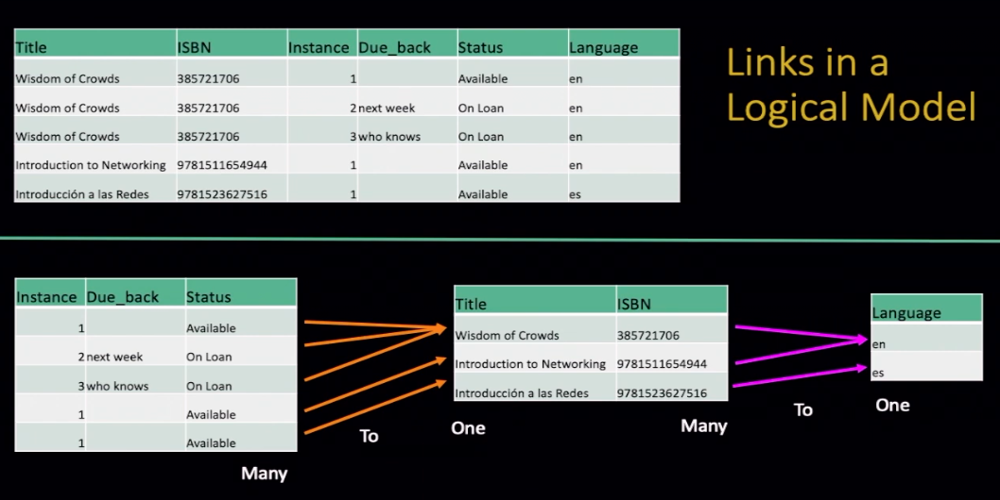
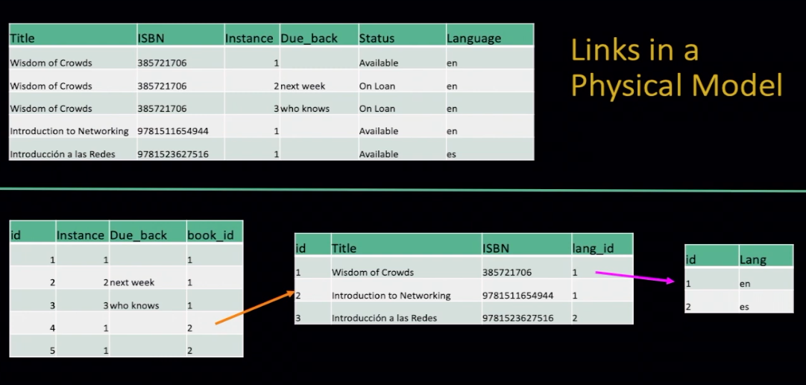
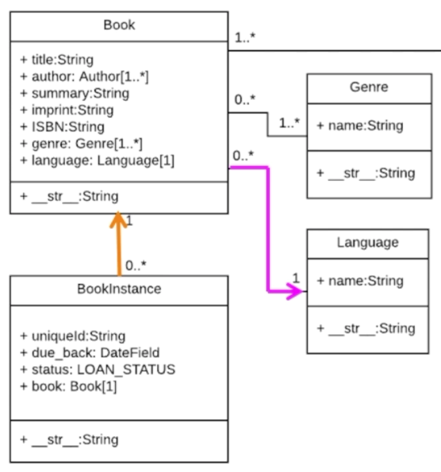

# Django Dynamic Web Applications with Python 3

# Table of Contents:

- [Django Dynamic Web Applications with Python 3](#django-dynamic-web-applications-with-python-3)
- [Table of Contents:](#table-of-contents)
- [Web Application Technologies](#web-application-technologies)
  - [Browser:](#browser)
  - [Web Server:](#web-server)
  - [HTTP: Hyper Text Transfer Protocol](#http-hyper-text-transfer-protocol)
  - [IETF](#ietf)
  - [RFCs](#rfcs)
  - [TCP connection / Sockets](#tcp-connection--sockets)
    - [socket1.py](#socket1py)
    - [client1.py](#client1py)
    - [client2.py](#client2py)
- [Installing Django](#installing-django)
- [SQL Sumary](#sql-sumary)
- [Object Relational Mapping - ORM](#object-relational-mapping---orm)
  - [Defining a Table](#defining-a-table)
  - [CRUD in the ORM](#crud-in-the-orm)
    - [Model Field Types in ORM](#model-field-types-in-orm)
    - [Django for Everybody - Single Table Models](#django-for-everybody---single-table-models)
  - [Sumary of ORM](#sumary-of-orm)
- [Migrations from Model to DB](#migrations-from-model-to-db)
- [One-To-Many Data Models](#one-to-many-data-models)
  - [Model Design](#model-design)
  - [Database Normalization (3NF)](#database-normalization-3nf)
  - [Representing Links (Relationships) in a Database](#representing-links-relationships-in-a-database)
      - [About on\_delete](#about-on_delete)
  - [Using Models in the Django Shell](#using-models-in-the-django-shell)
  - [Demo Bash Loading from CSV](#demo-bash-loading-from-csv)
      - [Make a scripts folder](#make-a-scripts-folder)


# Web Application Technologies

## Browser: 
HTML, CSS, DOM, JavaScript, JQuery

```python
import urllib.request

fhand = urllib.request.urlopen('http://data.pr4e.org/romeo.txt')
for line in fhand:
    print(line.decode().strip())
```


## Web Server: 
Django / Flask; sqlite3 / MySql

```python
from socket import *

def createServer():
    serversocket = socket(AF_INET, SOCK_STREAM)
    try :
        serversocket.bind(('localhost',9000))
        serversocket.listen(5)
        while(1):
            (clientsocket, address) = serversocket.accept()

            rd = clientsocket.recv(5000).decode()
            pieces = rd.split("\n")
            if ( len(pieces) > 0 ) : print(pieces[0])

            data = "HTTP/1.1 200 OK\r\n"
            data += "Content-Type: text/html; charset=utf-8\r\n"
            data += "\r\n"
            data += "<html><body>Hello World</body></html>\r\n\r\n"
            clientsocket.sendall(data.encode())
            clientsocket.shutdown(SHUT_WR)

    except KeyboardInterrupt :
        print("\nShutting down...\n");
    except Exception as exc :
        print("Error:\n");
        print(exc)

    serversocket.close()

print('Access http://localhost:9000')
createServer()
```

## HTTP: Hyper Text Transfer Protocol
```bash
uniform resource locator:
http://  | data.pr4e.org | /page1.htm
protocol |     host      |  document
```

Refs:
https://docs.python.org/3/howto/sockets.html
https://stackoverflow.com/questions/8627986/how-to-keep-a-socket-open-until-client-closes-it
https://stackoverflow.com/questions/10091271/how-can-i-implement-a-simple-web-server-using-python-without-using-any-libraries


make a connection => request a document => retrieve the document => close the connection

 - in client exec a request => througth socket / port (80) => to server 
 - process in server and response => througth socket / same port (80) => to cliente
   - usually ports 80 or 443 for web

## IETF
Internet Engineering Task Force
www.ietf.org

## RFCs
Standards are called RFCs - requests for comments

```bash
telnet data.pr4e.org 80
Trying 192.241.136.170...
Connected to data.pr4e.org.
Escape character is '^]'.
K^F
HTTP/1.1 400 Bad Request
Date: Thu, 08 Aug 2024 09:31:08 GMT
Server: Apache/2.4.52 (Ubuntu)
Content-Length: 308
Connection: close
Content-Type: text/html; charset=iso-8859-1
```
```html
<!DOCTYPE HTML PUBLIC "-//IETF//DTD HTML 2.0//EN">
<html><head>
<title>400 Bad Request</title>
</head><body>
<h1>Bad Request</h1>
<p>Your browser sent a request that this server could not understand.<br />
</p>
<hr>
<address>Apache/2.4.52 (Ubuntu) Server at do1.dr-chuck.com Port 80</address>
</body></html>
Connection closed by foreign host.
```

## TCP connection / Sockets
socket is an endpoint of a bidectional inter-process communication flow across internet protocol-based computer network 

### socket1.py

```python
import socket

mysock = socket.socket(socket.AF_INET, socket.SOCK_STREAM)
mysock.connect(('data.pr4e.org', 80))
cmd = 'GET http://data.pr4e.org/page1.htm HTTP/1.0\r\n\r\n'.encode()
mysock.send(cmd)

while True:
    data = mysock.recv(512)
    if len(data) < 1:
        break
    print(data.decode(),end='')

mysock.close()
```

### client1.py

```python
import socket

mysock = socket.socket(socket.AF_INET, socket.SOCK_STREAM)
mysock.connect(('127.0.0.1', 9000))
cmd = 'GET http://127.0.0.1/romeo.txt HTTP/1.0\r\n\r\n'.encode()
mysock.send(cmd)

while True:
    data = mysock.recv(512)
    if len(data) < 1:
        break
    print(data.decode(),end='')

mysock.close()
```

### client2.py

```python
import urllib.request

fhand = urllib.request.urlopen('http://127.0.0.1:9000/romeo.txt')
for line in fhand:
    print(line.decode().strip())
```


# Installing Django

in PythonAnywhere

```shell
#!/bin/bash

# Configs and Setup do work within PythonAnywhere
# https://www.pythonanywhere.com


mkvirtualenv django42 --python=/usr/bin/python3.9
pip install django==4.2.7

workon django42 #to start and step in virtual environment

python --version
# This should show something like Python 3.9.5
python -m django --version
# This should show something like 4.2.7

##Automatically Enabling Your Virtual Environment

# Each time you start a new shell, you will need to activate your virtual environment. It is a lot simpler to do this automatically every time you login by editing the .bashrc file in your home directory.
#/home/(your-account)/.bashrc
# Look for lines near the end of the file that look like:
# Load virtualenvwrapper
#source virtualenvwrapper.sh &> /dev/null
#Add the following lines to the file and save the file.
# Auto switch into django42 virtual environment
workon django42

# To activate this run
#
# pip install -r requirements.txt
# python -m django --version
#
# On a Macintosh this should be python3 and pip3
#
Django==4.2.7

# If you want to use MySQL, and are not running on PythonAnywhere,
# uncomment the following line you might need to install pre-requisite
# libraries before mysqlclient will work - instructions are at
#   https://pypi.org/project/mysqlclient/

# mysqlclient==2.1.1

# Other requirments - frozen to a version to simplify tech support
asgiref==3.7.2
certifi==2023.7.22
cffi==1.15.1
charset-normalizer==3.2.0
crispy-bootstrap5==0.7
cryptography==41.0.6
defusedxml==0.7.1
django-crispy-forms==2.0
django-extensions==3.2.3
django-filter==23.2
django-taggit==4.0.0
djangorestframework==3.14.0
idna==3.4
importlib-metadata==6.8.0
Markdown==3.4.3
oauthlib==3.2.2
pycparser==2.21
PyJWT==2.7.0
python3-openid==3.2.0
pytz==2023.3
requests==2.31.0
requests-oauthlib==1.3.1
social-auth-app-django==5.2.0
social-auth-core==4.4.2
sqlparse==0.4.4
typing_extensions==4.7.1
urllib3==2.0.7
zipp==3.15.0

# To activate this run
#
# pip install -r requirements.txt
# python -m django --version
#
# On a Macintosh this should be python3 and pip3
#
Django==4.2.7

# If you want to use MySQL, and are not running on PythonAnywhere,
# uncomment the following line you might need to install pre-requisite
# libraries before mysqlclient will work - instructions are at
#   https://pypi.org/project/mysqlclient/

# mysqlclient==2.1.1

# Other requirments - frozen to a version to simplify tech support
asgiref==3.7.2
certifi==2023.7.22
cffi==1.15.1
charset-normalizer==3.2.0
crispy-bootstrap5==0.7
cryptography==41.0.6
defusedxml==0.7.1
django-crispy-forms==2.0
django-extensions==3.2.3
django-filter==23.2
django-taggit==4.0.0
djangorestframework==3.14.0
idna==3.4
importlib-metadata==6.8.0
Markdown==3.4.3
oauthlib==3.2.2
pycparser==2.21
PyJWT==2.7.0
python3-openid==3.2.0
pytz==2023.3
requests==2.31.0
requests-oauthlib==1.3.1
social-auth-app-django==5.2.0
social-auth-core==4.4.2
sqlparse==0.4.4
typing_extensions==4.7.1
urllib3==2.0.7
zipp==3.15.0

# To activate this run
#
# pip install -r requirements.txt
# python -m django --version
#
# On a Macintosh this should be python3 and pip3
#
Django==4.2.7

# If you want to use MySQL, and are not running on PythonAnywhere,
# uncomment the following line you might need to install pre-requisite
# libraries before mysqlclient will work - instructions are at
#   https://pypi.org/project/mysqlclient/

# mysqlclient==2.1.1

# Other requirments - frozen to a version to simplify tech support
asgiref==3.7.2
certifi==2023.7.22
cffi==1.15.1
charset-normalizer==3.2.0
crispy-bootstrap5==0.7
cryptography==41.0.6
defusedxml==0.7.1
django-crispy-forms==2.0
django-extensions==3.2.3
django-filter==23.2
django-taggit==4.0.0
djangorestframework==3.14.0
idna==3.4
importlib-metadata==6.8.0
Markdown==3.4.3
oauthlib==3.2.2
pycparser==2.21
PyJWT==2.7.0
python3-openid==3.2.0
pytz==2023.3
requests==2.31.0
requests-oauthlib==1.3.1
social-auth-app-django==5.2.0
social-auth-core==4.4.2
sqlparse==0.4.4
typing_extensions==4.7.1
urllib3==2.0.7
zipp==3.15.0

#Installing the Sample Code for DJ4E

#Lets also get a copy of the sample code for DJ4E checked out so you can look at sample code as the course progresses and install some important additional Django software libraries using pip.

cd ~
git clone https://github.com/csev/dj4e-samples
cd ~/dj4e-samples
pip install -r requirements42.txt

#The pip command can also take a few minutes to complete. Once it finishes and you get the $ prompt again, check for a good instlal by running:

cd ~/dj4e-samples
python manage.py check

#When running 'check' works
#Once the check works do:

python manage.py makemigrations

#This is the normal output of the makemigrations:
#When you want to use social login, please see dj4e-samples/github_settings-dist.py
#Using registration/login.html as the login template
#No changes detected

#Then run:

python manage.py migrate

#Building Your Application
#Now that we have your Django set up and you have retrieved the sample code for DJ4E, lets build your first application in the PYAW shell:

cd ~
mkdir django_projects

#Once you have made a folder in your home directory, lets go into that folder and make a Django project.

cd ~/django_projects
django-admin startproject mysite

#At this point, keep your shell open in one tab and open the PythonAnywhere Files application in another browser tab and navigate to the ~/django_projects/mysite/mysite/settings.py and change the allowed hosts line (around line 28) to be:
#this make accept connections all over the world

 ALLOWED_HOSTS = [ '*' ]
```


# SQL Sumary 
```bash
sqlite3 zip.sqlite3

.mode column

CREATE TABLE "Users" (
    "id" INTEGER PRIMARY KEY AUTOINCREMENT NOT NULL UNIQUE, 
    "name" TEXT,
    "email" TEXT
);

.tables

.schema Users

INSERT INTO Users (name, email) VALUES ('Carlos', 'carlos@email')
INSERT INTO Users (name, email) VALUES ('Kristen', 'kf@umich.edu');
INSERT INTO Users (name, email) VALUES ('Chuck', 'csev@umich.edu');
INSERT INTO Users (name, email) VALUES ('Colleen', 'cvl@umich.edu');
INSERT INTO Users (name, email) VALUES ('Ted', 'ted@umich.edu');
INSERT INTO Users (name, email) VALUES ('Sally', 'a1@umich.edu');

DELETE FROM Users WHERE email='carlos@email'
DELETE FROM Users WHERE email='ted@umich.edu';

UPDATE Users SET name="Carlos" WHERE email='carlos@email'

SELECT * FROM Users

SELECT * FROM Users WHERE email='carlos@email'

SELECT * FROM Users ORDER BY email;

SELECT * FROM Users ORDER BY name DESC;

DROP TABLE Users; 

.quit
```

# Object Relational Mapping - ORM

Allow to map tables to objects and columns
Use those objects to store and retrieve data from the db
improve portability across dbs dialects (SQLite, MySQL, Postgres, Oracle)
Django create a model in top of the dbs dialects

Python Model Library 
    models.py           < == >      dbs / dialects

## Defining a Table
 ```SQL
 CREATE TABLE Users(name VARCHAR(128), email VARCHAR(128));
 ```
 ```python
 //models.py

 from django.db import models

 class User(models.Model):
    name = models.CharField(max_length=128)
    email = models.CharField(max_length=128)
```
This is a migration explanation / implementation

In practice we do:
```python
python3 manage.py makemigrations

python3 manage.py migrate
```

## CRUD in the ORM

```python
u = User(name='Sally', email='sally@email')
u.save()

User.objects.values()
User.objects.filter(email='sally@email').values()

User.objects.filter(email='sally@email').delete()
User.objects.values()

User.objects.filter(email='sally@email').update(name='saly')
User.objects.values()

User.objects.values().order_by('email')
User.objects.values().order_by('-name')
```

### Model Field Types in ORM
- AutoField
- BigAutoField
- BigIntegerField
- BinaryField
- BooleanField
- CharField
- DateField
- DateTimeField
- DecimalField
- DurationField
- EmailField
- FileField
- FilePathField
- FloatField
- ImageField
- IntegerField
- GenericIPAddressField
- NullBooleanField
- PositiveIntegerField
- PositiveSmallIntegerField
- SlugField
- SmallIntegerField
- TextField
- TimeField
- URLField
- ForeignKey
- ManyToManyField
- OneToOneField

### Django for Everybody - Single Table Models

https://www.dj4e.com/lectures/DJ-02-Model-Single.txt

You can check out the Django code for this project at:

https://github.com/csev/dj4e-samples

Start the command line in a Linux/Bash shell and go into your project folder.
Activate a virtual environment if needed.
```bash
cd dj4e-samples
git pull                          # incase there are updates
pip install -r requirements4.txt  # to make sure that all the utilities are there

python manage.py check           # Make sure things are set up
python manage.py makemigrations  # Probably won't find any changes
rm db.sqlite3                     # In case you have done this before
python manage.py migrate         # Create the database and table(s)

#Start the django shell:

python manage.py shell

# (In the shell at the prompt) 

from users.models import User

u = User(name='Kristen', email='kf@umich.edu')
u.save()
u = User(name='Chuck', email='csev@umich.edu')
u.save()
u = User(name='Colleen', email='cvl@umich.edu')
u.save()
u = User(name='Ted', email='ted@umich.edu')
u.save()
u = User(name='Sally', email='a2@umich.edu')
u.save()

User.objects.values()
<QuerySet [{'id': 1, 'name': 'Kristen', 'email': 'kf@umich.edu'}, {'id': 2, 'name': 'Charles', 'email': 'csev@umich.edu'}, {'id': 3, 'name': 'Colleen', 'email': 'cvl@umich.edu'
}, {'id': 5, 'name': 'Sally', 'email': 'a2@umich.edu'}, {'id': 6, 'name': 'Kristen', 'email': 'kf@umich.edu'}, {'id': 7, 'name': 'Chuck', 'email': 'csev@umich.edu'}, {'id': 8, 
'name': 'Colleen', 'email': 'cvl@umich.edu'}, {'id': 9, 'name': 'Ted', 'email': 'ted@umich.edu'}, {'id': 10, 'name': 'Sally', 'email': 'a2@umich.edu'}]>

User.objects.filter(email='csev@umich.edu').values()
<QuerySet [{'id': 2, 'name': 'Charles', 'email': 'csev@umich.edu'}, {'id': 7, 'name': 'Chuck', 'email': 'csev@umich.edu'}]>

User.objects.filter(email='ted@umich.edu').delete()
User.objects.values()

User.objects.filter(email='csev@umich.edu').update(name='Charles')
User.objects.values()

User.objects.values().order_by('email')
User.objects.values().order_by('-name')

quit()
```

## Sumary of ORM

The Django Models feature implements an Object Relational Mapper
Benefits of it:
- can write only Python code, no need for explicit SQL codes;
- gain in db portability
- migrations both create and evolve the db schema
- a sweet administration interface
- automatic form generation and validation


# Migrations from Model to DB

- The `makemigrations` command reads all the models.py files in all the applications, end creates / evolves the migration files
- Guided by the applications listed in settings.py
- Migrations are portable across dbs
- The `migrate` command reads all the migrations folder in the application folders and creates / evolves the tables in the db.

The sumary is: `makemigrations` runs all models.py files and transforme it in a file that can actualy use explicit dbs languages. Than run `migrate` command to to run these new files created by the previous `makemigration` and finally combine models and / or data to the db.

# One-To-Many Data Models

model.py
admin.py

## Model Design
 - Model design is an art form of its own with particular skills and experience
 - Our goarl is to avoid the really bad mistakes and design clean and easily understood models
 - Model design starts with a sample data set and draws a picture


## Database Normalization (3NF)
 - there is tons of database theory/math - we simplify this to a few rules
 - Do not replicate data - reference data - point at data
 - add a special unique key column to each table which we will make references to. By convention many programmers and frameworks call this column id
 - use integers for to make links between tables - integers are fast and small


## Representing Links (Relationships) in a Database

First study, just slice the initial data set in as many tables as we need to do not repeat data


Applying concept of keys to link tables, primary-key and foreign-key


Basic modelling concept for the 3 tables we need, Languages, Books and Instance of Book

```python
from django.db import models

class Lang(models.Model):
    name = models.CharField(max_length=200)

class Book(models.Model):
    title = models.CharField(max_length=200) 
    isbn = models.CharField(max_length=13) 
    lang = models.ForeignKey('Lang', on_delete=models.SET_NULL, null=True) #allowing empty

class Instance(models.Model):
    book = models.ForeignKey('Book', on_delete=models.CASCADE)
    due_book = models.DataField(null=True, blank=True)
```

The data model diagram represents with the magenta arrow the `Book` data schema, and with the yellow arrow the `Instance` schema.



#### About on_delete
 - on_delete = set_null # => keep the row but set foreign key to null
 - on_delete = cascade # => delete the row

It's very important to correct manage conditions for the foreign keys to keep the table and the relationship between tables valid on deleting.

The conditions on_delete in the classes say:
- If a Language is deleted is ok for a Book to do not have any language, because Books are allowed to do not have a language by saying null=True `lang = models.ForeignKey('Lang', on_delete=models.SET_NULL, null=True)`
- If a Book is deleted we do not need an Instance for that particular Book, so we use cascade to delete all instances of the book that was deleted. `due_book = models.DataField(null=True, blank=True)`

## Using Models in the Django Shell

```shell
cd ~/dj4e-samples
python3 manage.py shell
```
```python
from bookone.models import Book, Lang, Instace
z = Lang(name='en')
z.save()
z.id

x = Book(title='PY4E', isbn='42', lang=z)
x.save()
x.id

a = Instance(due_back="2020-07-06", book=x)
a.save()
a.id

quit()
```

## Demo Bash Loading from CSV
```bash
pip3 install django-extensions
```
#### Make a scripts folder
```bash
mkdir scripts
touch scripts/__init__.py
```
We place empty __init__.py files in folders to indicate to Python that they contain files that hold modules and as such are suitable for importing into a Python application


