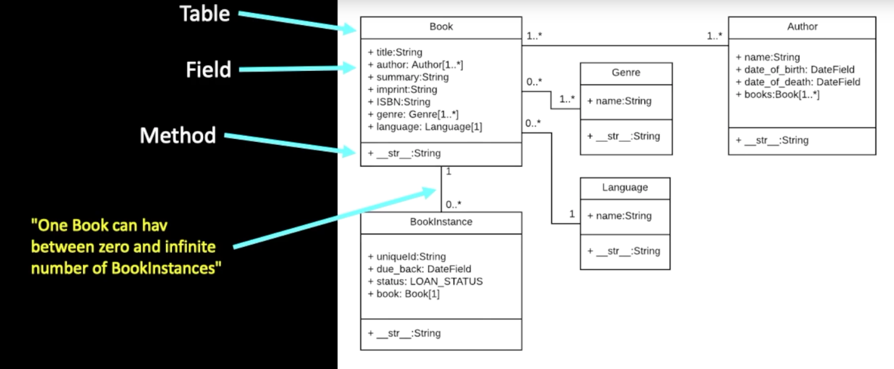
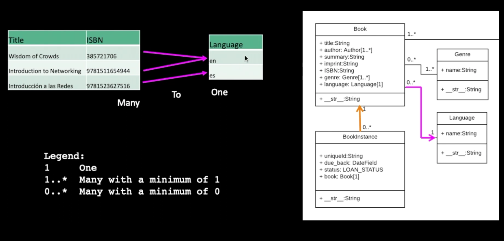
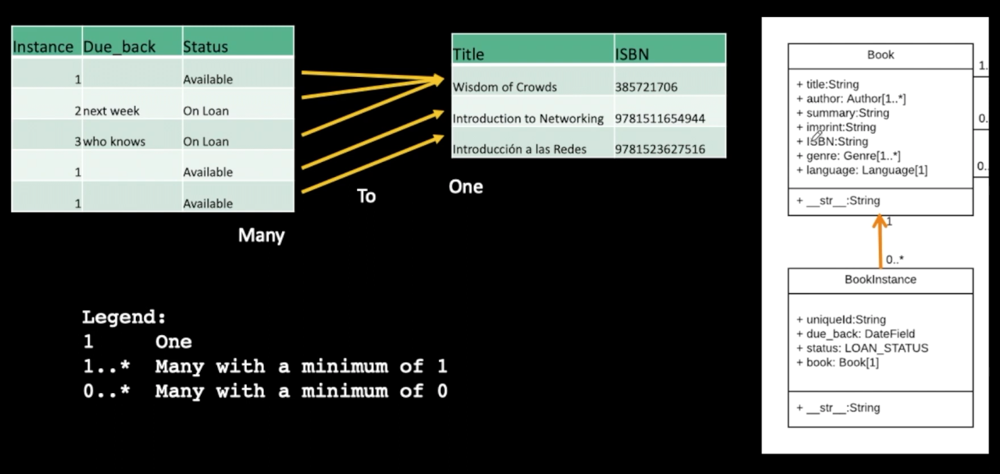

# Django Dynamic Web Applications with Python 3

# Table of Contents:

- [Django Dynamic Web Applications with Python 3](#django-dynamic-web-applications-with-python-3)
- [Table of Contents:](#table-of-contents)
- [Web Application Technologies](#web-application-technologies)
  - [Browser:](#browser)
  - [Web Server:](#web-server)
  - [HTTP: Hyper Text Transfer Protocol](#http-hyper-text-transfer-protocol)
  - [IETF](#ietf)
  - [RFCs](#rfcs)
  - [TCP connection / Sockets](#tcp-connection--sockets)
    - [socket1.py](#socket1py)
    - [client1.py](#client1py)
    - [client2.py](#client2py)
- [Installing Django](#installing-django)
- [SQL Sumary](#sql-sumary)
- [Object Relational Mapping - ORM](#object-relational-mapping---orm)
  - [Defining a Table](#defining-a-table)
  - [CRUD in the ORM](#crud-in-the-orm)
    - [Model Field Types in ORM](#model-field-types-in-orm)
    - [Django for Everybody - Single Table Models](#django-for-everybody---single-table-models)
  - [Sumary of ORM](#sumary-of-orm)
- [Migrations from Model to DB](#migrations-from-model-to-db)
- [One-To-Many Data Models](#one-to-many-data-models)
  - [Model Design](#model-design)
  - [Database Normalization (3NF)](#database-normalization-3nf)
  - [Representing Links (Relationships) in a Database](#representing-links-relationships-in-a-database)
      - [About on\_delete](#about-on_delete)
  - [Using Models in the Django Shell](#using-models-in-the-django-shell)
  - [Demo Bash Loading from CSV](#demo-bash-loading-from-csv)
      - [Make a scripts folder](#make-a-scripts-folder)
- [Many-To-Many Data Models](#many-to-many-data-models)
- [Django Views and Templates](#django-views-and-templates)
  - [Secure Applications:](#secure-applications)
    - [XXS - Cross-Site Scripting](#xxs---cross-site-scripting)
    - [1. **Automatic Template Escaping**](#1-automatic-template-escaping)
    - [2. **Use of Template Filters**](#2-use-of-template-filters)
    - [3. **XSS Protection in Forms**](#3-xss-protection-in-forms)
    - [4. **Use of Content Security Policy (CSP)**](#4-use-of-content-security-policy-csp)
    - [5. **Sanitizing User Input**](#5-sanitizing-user-input)
    - [6. **Additional Security Headers**](#6-additional-security-headers)
    - [7. **Regular Audits and Testing**](#7-regular-audits-and-testing)
    - [Summary](#summary)
  - [Front End Template Process](#front-end-template-process)
  - [DTL - Django Template Language](#dtl---django-template-language)
  - [Inheritance](#inheritance)
  - [URL Mapping / Reversing](#url-mapping--reversing)
  - [Generic Views:](#generic-views)
    - [Sumary:](#sumary)
- [Inside a Generic Edit View](#inside-a-generic-edit-view)
  - [Owner List View](#owner-list-view)
    - [Models:](#models)
    - [Views:](#views)
    - [Models:](#models-1)
    - [References](#references)
- [Cookies and Sessions](#cookies-and-sessions)
  - [Multi-User / Multi-Browser](#multi-user--multi-browser)
  - [Django Cookies:](#django-cookies)
    - [Web Cookie to the Rescue](#web-cookie-to-the-rescue)
    - [Cookies in the Browser](#cookies-in-the-browser)
  - [Django Sessions](#django-sessions)
    - [In the Server - Sessions](#in-the-server---sessions)
    - [Session Identifier](#session-identifier)
      - [Enabling Sessions in Django](#enabling-sessions-in-django)
    - [Sumary of Django Sessions](#sumary-of-django-sessions)
- [Loggin \& Authentication](#loggin--authentication)
  - [Setting up login](#setting-up-login)
- [Forms in HTTP and HTML](#forms-in-http-and-html)
  - [Rules of the POST/GET choice](#rules-of-the-postget-choice)
    - [Building HTML Forms](#building-html-forms)
  - [Security](#security)
    - [CSRF - Cross-Site-Request-Forgery](#csrf---cross-site-request-forgery)
    - [Enabling CSRF defense in Django](#enabling-csrf-defense-in-django)
    - [CSRF in Forms](#csrf-in-forms)
  - [The POST Refresh Pattern](#the-post-refresh-pattern)
  - [POST-REDIRECT-GET-Refresh](#post-redirect-get-refresh)
- [Forms in Django](#forms-in-django)
  - [Data validation](#data-validation)
- [Object Oriented Programming in Python](#object-oriented-programming-in-python)
  - [Definitions](#definitions)
    - [Class](#class)
    - [Method or Message](#method-or-message)
    - [Field or Attribute](#field-or-attribute)
    - [Object or Instance](#object-or-instance)
    - [Sumary Definitions](#sumary-definitions)
  - [Object Lifecycle](#object-lifecycle)
    - [Many Instances:](#many-instances)
    - [Inheritance](#inheritance-1)
  - [Data Structures](#data-structures)
    - [Using Lists as Queues](#using-lists-as-queues)
    - [List Comprehensions](#list-comprehensions)
    - [Nested List Comprehensions](#nested-list-comprehensions)
    - [The del statement](#the-del-statement)
    - [Tuples and Sequences](#tuples-and-sequences)
    - [Sets](#sets)
    - [Dictionaries](#dictionaries)
    - [Looping Techniques](#looping-techniques)
    - [More on Conditions](#more-on-conditions)
- [JavaScript Basic Concepts for OOP](#javascript-basic-concepts-for-oop)
  - [Base of writing JavaScript](#base-of-writing-javascript)
    - [Variable Names](#variable-names)
    - [String Constants](#string-constants)
    - [Numeric Constants](#numeric-constants)
    - [Comparison Operators](#comparison-operators)
    - [Logical Operators](#logical-operators)
    - [Variable Conversion](#variable-conversion)
  - [Functions and Arrays](#functions-and-arrays)
    - [Scope - Global (defalt)](#scope---global-defalt)
  - [In Javascript we have Objects \& Arrays](#in-javascript-we-have-objects--arrays)
  - [Control Structures](#control-structures)
    - [Conditionl - if](#conditionl---if)
    - [Multi-way Ifs](#multi-way-ifs)
    - [for loop](#for-loop)
    - [Breaking Out of a loop](#breaking-out-of-a-loop)
- [Object Oriented Programming in JavaScript](#object-oriented-programming-in-javascript)
  - [Definitions:](#definitions-1)
  - [Terminology:](#terminology)
    - [Instance:](#instance)
    - [Method:](#method)
    - [Objects in Javascript](#objects-in-javascript)
    - [First-Class Functions](#first-class-functions)
  - [Object Life Cycle](#object-life-cycle)
  - [Many Instances](#many-instances-1)
- [](#)


# Web Application Technologies

## Browser: 
HTML, CSS, DOM, JavaScript, JQuery

```python
import urllib.request

fhand = urllib.request.urlopen('http://data.pr4e.org/romeo.txt')
for line in fhand:
    print(line.decode().strip())
```


## Web Server: 
Django / Flask; sqlite3 / MySql

server.py
```python
from socket import *

def createServer():
    serversocket = socket(AF_INET, SOCK_STREAM)
    try :
        serversocket.bind(('localhost',9000))
        serversocket.listen(5)
        while(1):
            (clientsocket, address) = serversocket.accept()

            rd = clientsocket.recv(5000).decode()
            pieces = rd.split("\n")
            if ( len(pieces) > 0 ) : print(pieces[0])

            data = "HTTP/1.1 200 OK\r\n"
            data += "Content-Type: text/html; charset=utf-8\r\n"
            data += "\r\n"
            data += "<html><body>Hello World</body></html>\r\n\r\n"
            clientsocket.sendall(data.encode())
            clientsocket.shutdown(SHUT_WR)

    except KeyboardInterrupt :
        print("\nShutting down...\n");
    except Exception as exc :
        print("Error:\n");
        print(exc)

    serversocket.close()

print('Access http://localhost:9000')
createServer()
```

redirect.py
```python
from socket import *

def createServer():
    serversocket = socket(AF_INET, SOCK_STREAM)
    try :
        serversocket.bind(('localhost',9001))
        serversocket.listen(5)
        while(1):
            (clientsocket, address) = serversocket.accept()

            rd = clientsocket.recv(5000).decode()
            pieces = rd.split("\n")
            if ( len(pieces) > 0 ) : print(pieces[0])

            print("Move along, nothing to see here...\n")

            data = "HTTP/1.1 302 OK\r\n"
            data += "Location: https://www.dj4e.com/\r\n"
            data += "\r\n"
            clientsocket.sendall(data.encode())
            clientsocket.shutdown(SHUT_WR)

    except KeyboardInterrupt :
        print("\nShutting down...\n");
    except Exception as exc :
        print("Error:\n");
        print(exc)

    serversocket.close()

print('Access http://localhost:9001')
createServer()
```
Refs:
https://docs.python.org/3/howto/sockets.html
https://stackoverflow.com/questions/8627986/how-to-keep-a-socket-open-until-client-closes-it
https://stackoverflow.com/questions/10091271/how-can-i-implement-a-simple-web-server-using-python-without-using-any-libraries


## HTTP: Hyper Text Transfer Protocol
```bash
uniform resource locator:
http://  | data.pr4e.org | /page1.htm
protocol |     host      |  document
```

Refs:
https://docs.python.org/3/howto/sockets.html
https://stackoverflow.com/questions/8627986/how-to-keep-a-socket-open-until-client-closes-it
https://stackoverflow.com/questions/10091271/how-can-i-implement-a-simple-web-server-using-python-without-using-any-libraries


make a connection => request a document => retrieve the document => close the connection

 - in client exec a request => througth socket / port (80) => to server 
 - process in server and response => througth socket / same port (80) => to cliente
   - usually ports 80 or 443 for web

## IETF
Internet Engineering Task Force
www.ietf.org

## RFCs
Standards are called RFCs - requests for comments

```bash
telnet data.pr4e.org 80
Trying 192.241.136.170...
Connected to data.pr4e.org.
Escape character is '^]'.
K^F
HTTP/1.1 400 Bad Request
Date: Thu, 08 Aug 2024 09:31:08 GMT
Server: Apache/2.4.52 (Ubuntu)
Content-Length: 308
Connection: close
Content-Type: text/html; charset=iso-8859-1
```
```html
<!DOCTYPE HTML PUBLIC "-//IETF//DTD HTML 2.0//EN">
<html><head>
<title>400 Bad Request</title>
</head><body>
<h1>Bad Request</h1>
<p>Your browser sent a request that this server could not understand.<br />
</p>
<hr>
<address>Apache/2.4.52 (Ubuntu) Server at do1.dr-chuck.com Port 80</address>
</body></html>
Connection closed by foreign host.
```

## TCP connection / Sockets
socket is an endpoint of a bidectional inter-process communication flow across internet protocol-based computer network 

### socket1.py

```python
import socket

mysock = socket.socket(socket.AF_INET, socket.SOCK_STREAM)
mysock.connect(('data.pr4e.org', 80))
cmd = 'GET http://data.pr4e.org/page1.htm HTTP/1.0\r\n\r\n'.encode()
mysock.send(cmd)

while True:
    data = mysock.recv(512)
    if len(data) < 1:
        break
    print(data.decode(),end='')

mysock.close()
```

### client1.py

```python
import socket

mysock = socket.socket(socket.AF_INET, socket.SOCK_STREAM)
mysock.connect(('127.0.0.1', 9000))
cmd = 'GET http://127.0.0.1/romeo.txt HTTP/1.0\r\n\r\n'.encode()
mysock.send(cmd)

while True:
    data = mysock.recv(512)
    if len(data) < 1:
        break
    print(data.decode(),end='')

mysock.close()
```

### client2.py

```python
import urllib.request

fhand = urllib.request.urlopen('http://127.0.0.1:9000/romeo.txt')
for line in fhand:
    print(line.decode().strip())
```


# Installing Django

in PythonAnywhere

```shell
#!/bin/bash

# Configs and Setup do work within PythonAnywhere
# https://www.pythonanywhere.com


mkvirtualenv django42 --python=/usr/bin/python3.9
pip install django==4.2.7

workon django42 #to start and step in virtual environment

python --version
# This should show something like Python 3.9.5
python -m django --version
# This should show something like 4.2.7

##Automatically Enabling Your Virtual Environment

# Each time you start a new shell, you will need to activate your virtual environment. It is a lot simpler to do this automatically every time you login by editing the .bashrc file in your home directory.
#/home/(your-account)/.bashrc
# Look for lines near the end of the file that look like:
# Load virtualenvwrapper
#source virtualenvwrapper.sh &> /dev/null
#Add the following lines to the file and save the file.
# Auto switch into django42 virtual environment
workon django42

# To activate this run
#
# pip install -r requirements.txt
# python -m django --version
#
# On a Macintosh this should be python3 and pip3
#
Django==4.2.7

# If you want to use MySQL, and are not running on PythonAnywhere,
# uncomment the following line you might need to install pre-requisite
# libraries before mysqlclient will work - instructions are at
#   https://pypi.org/project/mysqlclient/

# mysqlclient==2.1.1

# Other requirments - frozen to a version to simplify tech support
asgiref==3.7.2
certifi==2023.7.22
cffi==1.15.1
charset-normalizer==3.2.0
crispy-bootstrap5==0.7
cryptography==41.0.6
defusedxml==0.7.1
django-crispy-forms==2.0
django-extensions==3.2.3
django-filter==23.2
django-taggit==4.0.0
djangorestframework==3.14.0
idna==3.4
importlib-metadata==6.8.0
Markdown==3.4.3
oauthlib==3.2.2
pycparser==2.21
PyJWT==2.7.0
python3-openid==3.2.0
pytz==2023.3
requests==2.31.0
requests-oauthlib==1.3.1
social-auth-app-django==5.2.0
social-auth-core==4.4.2
sqlparse==0.4.4
typing_extensions==4.7.1
urllib3==2.0.7
zipp==3.15.0

# To activate this run
#
# pip install -r requirements.txt
# python -m django --version
#
# On a Macintosh this should be python3 and pip3
#
Django==4.2.7

# If you want to use MySQL, and are not running on PythonAnywhere,
# uncomment the following line you might need to install pre-requisite
# libraries before mysqlclient will work - instructions are at
#   https://pypi.org/project/mysqlclient/

# mysqlclient==2.1.1

# Other requirments - frozen to a version to simplify tech support
asgiref==3.7.2
certifi==2023.7.22
cffi==1.15.1
charset-normalizer==3.2.0
crispy-bootstrap5==0.7
cryptography==41.0.6
defusedxml==0.7.1
django-crispy-forms==2.0
django-extensions==3.2.3
django-filter==23.2
django-taggit==4.0.0
djangorestframework==3.14.0
idna==3.4
importlib-metadata==6.8.0
Markdown==3.4.3
oauthlib==3.2.2
pycparser==2.21
PyJWT==2.7.0
python3-openid==3.2.0
pytz==2023.3
requests==2.31.0
requests-oauthlib==1.3.1
social-auth-app-django==5.2.0
social-auth-core==4.4.2
sqlparse==0.4.4
typing_extensions==4.7.1
urllib3==2.0.7
zipp==3.15.0

# To activate this run
#
# pip install -r requirements.txt
# python -m django --version
#
# On a Macintosh this should be python3 and pip3
#
Django==4.2.7

# If you want to use MySQL, and are not running on PythonAnywhere,
# uncomment the following line you might need to install pre-requisite
# libraries before mysqlclient will work - instructions are at
#   https://pypi.org/project/mysqlclient/

# mysqlclient==2.1.1

# Other requirments - frozen to a version to simplify tech support
asgiref==3.7.2
certifi==2023.7.22
cffi==1.15.1
charset-normalizer==3.2.0
crispy-bootstrap5==0.7
cryptography==41.0.6
defusedxml==0.7.1
django-crispy-forms==2.0
django-extensions==3.2.3
django-filter==23.2
django-taggit==4.0.0
djangorestframework==3.14.0
idna==3.4
importlib-metadata==6.8.0
Markdown==3.4.3
oauthlib==3.2.2
pycparser==2.21
PyJWT==2.7.0
python3-openid==3.2.0
pytz==2023.3
requests==2.31.0
requests-oauthlib==1.3.1
social-auth-app-django==5.2.0
social-auth-core==4.4.2
sqlparse==0.4.4
typing_extensions==4.7.1
urllib3==2.0.7
zipp==3.15.0

#Installing the Sample Code for DJ4E

#Lets also get a copy of the sample code for DJ4E checked out so you can look at sample code as the course progresses and install some important additional Django software libraries using pip.

cd ~
git clone https://github.com/csev/dj4e-samples
cd ~/dj4e-samples
pip install -r requirements42.txt

#The pip command can also take a few minutes to complete. Once it finishes and you get the $ prompt again, check for a good instlal by running:

cd ~/dj4e-samples
python manage.py check

#When running 'check' works
#Once the check works do:

python manage.py makemigrations

#This is the normal output of the makemigrations:
#When you want to use social login, please see dj4e-samples/github_settings-dist.py
#Using registration/login.html as the login template
#No changes detected

#Then run:

python manage.py migrate

#Building Your Application
#Now that we have your Django set up and you have retrieved the sample code for DJ4E, lets build your first application in the PYAW shell:

cd ~
mkdir django_projects

#Once you have made a folder in your home directory, lets go into that folder and make a Django project.

cd ~/django_projects
django-admin startproject mysite

#At this point, keep your shell open in one tab and open the PythonAnywhere Files application in another browser tab and navigate to the ~/django_projects/mysite/mysite/settings.py and change the allowed hosts line (around line 28) to be:
#this make accept connections all over the world

 ALLOWED_HOSTS = [ '*' ]
```

# SQL Sumary 
```bash
sqlite3 zip.sqlite3

.mode column

CREATE TABLE "Users" (
    "id" INTEGER PRIMARY KEY AUTOINCREMENT NOT NULL UNIQUE, 
    "name" TEXT,
    "email" TEXT
);

.tables

.schema Users

INSERT INTO Users (name, email) VALUES ('Carlos', 'carlos@email')
INSERT INTO Users (name, email) VALUES ('Kristen', 'kf@umich.edu');
INSERT INTO Users (name, email) VALUES ('Chuck', 'csev@umich.edu');
INSERT INTO Users (name, email) VALUES ('Colleen', 'cvl@umich.edu');
INSERT INTO Users (name, email) VALUES ('Ted', 'ted@umich.edu');
INSERT INTO Users (name, email) VALUES ('Sally', 'a1@umich.edu');

DELETE FROM Users WHERE email='carlos@email'
DELETE FROM Users WHERE email='ted@umich.edu';

UPDATE Users SET name="Carlos" WHERE email='carlos@email'

SELECT * FROM Users

SELECT * FROM Users WHERE email='carlos@email'

SELECT * FROM Users ORDER BY email;

SELECT * FROM Users ORDER BY name DESC;

DROP TABLE Users; 

.quit
```

# Object Relational Mapping - ORM

Allow to map tables to objects and columns
Use those objects to store and retrieve data from the db
improve portability across dbs dialects (SQLite, MySQL, Postgres, Oracle)
Django create a model in top of the dbs dialects

Python Model Library 
    models.py           < == >      dbs / dialects

## Defining a Table
 ```SQL
 CREATE TABLE Users(name VARCHAR(128), email VARCHAR(128));
 ```
 ```python
 //models.py

 from django.db import models

 class User(models.Model):
    name = models.CharField(max_length=128)
    email = models.CharField(max_length=128)
```
This is a migration explanation / implementation

In practice we do:
```python
python3 manage.py makemigrations

python3 manage.py migrate
```

## CRUD in the ORM

```python
u = User(name='Sally', email='sally@email')
u.save()

User.objects.values()
User.objects.filter(email='sally@email').values()

User.objects.filter(email='sally@email').delete()
User.objects.values()

User.objects.filter(email='sally@email').update(name='saly')
User.objects.values()

User.objects.values().order_by('email')
User.objects.values().order_by('-name')
```

### Model Field Types in ORM
- AutoField
- BigAutoField
- BigIntegerField
- BinaryField
- BooleanField
- CharField
- DateField
- DateTimeField
- DecimalField
- DurationField
- EmailField
- FileField
- FilePathField
- FloatField
- ImageField
- IntegerField
- GenericIPAddressField
- NullBooleanField
- PositiveIntegerField
- PositiveSmallIntegerField
- SlugField
- SmallIntegerField
- TextField
- TimeField
- URLField
- ForeignKey
- ManyToManyField
- OneToOneField

### Django for Everybody - Single Table Models

https://www.dj4e.com/lectures/DJ-02-Model-Single.txt

You can check out the Django code for this project at:

https://github.com/csev/dj4e-samples

Start the command line in a Linux/Bash shell and go into your project folder.
Activate a virtual environment if needed.
```bash
cd dj4e-samples
git pull                          # incase there are updates
pip install -r requirements4.txt  # to make sure that all the utilities are there

python manage.py check           # Make sure things are set up
python manage.py makemigrations  # Probably won't find any changes
rm db.sqlite3                     # In case you have done this before
python manage.py migrate         # Create the database and table(s)

#Start the django shell:

python manage.py shell

# (In the shell at the prompt) 

from users.models import User

u = User(name='Kristen', email='kf@umich.edu')
u.save()
u = User(name='Chuck', email='csev@umich.edu')
u.save()
u = User(name='Colleen', email='cvl@umich.edu')
u.save()
u = User(name='Ted', email='ted@umich.edu')
u.save()
u = User(name='Sally', email='a2@umich.edu')
u.save()

User.objects.values()
<QuerySet [{'id': 1, 'name': 'Kristen', 'email': 'kf@umich.edu'}, {'id': 2, 'name': 'Charles', 'email': 'csev@umich.edu'}, {'id': 3, 'name': 'Colleen', 'email': 'cvl@umich.edu'
}, {'id': 5, 'name': 'Sally', 'email': 'a2@umich.edu'}, {'id': 6, 'name': 'Kristen', 'email': 'kf@umich.edu'}, {'id': 7, 'name': 'Chuck', 'email': 'csev@umich.edu'}, {'id': 8, 
'name': 'Colleen', 'email': 'cvl@umich.edu'}, {'id': 9, 'name': 'Ted', 'email': 'ted@umich.edu'}, {'id': 10, 'name': 'Sally', 'email': 'a2@umich.edu'}]>

User.objects.filter(email='csev@umich.edu').values()
<QuerySet [{'id': 2, 'name': 'Charles', 'email': 'csev@umich.edu'}, {'id': 7, 'name': 'Chuck', 'email': 'csev@umich.edu'}]>

User.objects.filter(email='ted@umich.edu').delete()
User.objects.values()

User.objects.filter(email='csev@umich.edu').update(name='Charles')
User.objects.values()

User.objects.values().order_by('email')
User.objects.values().order_by('-name')

quit()
```

## Sumary of ORM

The Django Models feature implements an Object Relational Mapper
Benefits of it:
- can write only Python code, no need for explicit SQL codes;
- gain in db portability
- migrations both create and evolve the db schema
- a sweet administration interface
- automatic form generation and validation


# Migrations from Model to DB

- The `makemigrations` command reads all the models.py files in all the applications, end creates / evolves the migration files
- Guided by the applications listed in settings.py
- Migrations are portable across dbs
- The `migrate` command reads all the migrations folder in the application folders and creates / evolves the tables in the db.

The sumary is: `makemigrations` runs all models.py files and transforme it in a file that can actualy use explicit dbs languages. Than run `migrate` command to to run these new files created by the previous `makemigration` and finally combine models and / or data to the db.

# One-To-Many Data Models

model.py
admin.py

## Model Design
 - Model design is an art form of its own with particular skills and experience
 - Our goarl is to avoid the really bad mistakes and design clean and easily understood models
 - Model design starts with a sample data set and draws a picture



## Database Normalization (3NF)
 - there is tons of database theory/math - we simplify this to a few rules
 - Do not replicate data - reference data - point at data
 - add a special unique key column to each table which we will make references to. By convention many programmers and frameworks call this column id
 - use integers for to make links between tables - integers are fast and small





## Representing Links (Relationships) in a Database

First study, just slice the initial data set in as many tables as we need to do not repeat data


Applying concept of keys to link tables, primary-key and foreign-key


Basic modelling concept for the 3 tables we need, Languages, Books and Instance of Book

```python
from django.db import models

class Lang(models.Model):
    name = models.CharField(max_length=200)

class Book(models.Model):
    title = models.CharField(max_length=200) 
    isbn = models.CharField(max_length=13) 
    lang = models.ForeignKey('Lang', on_delete=models.SET_NULL, null=True) #allowing empty

class Instance(models.Model):
    book = models.ForeignKey('Book', on_delete=models.CASCADE)
    due_book = models.DataField(null=True, blank=True)
```

The data model diagram represents with the magenta arrow the `Book` data schema, and with the yellow arrow the `Instance` schema.


#### About on_delete
 - on_delete = set_null # => keep the row but set foreign key to null
 - on_delete = cascade # => delete the row

It's very important to correct manage conditions for the foreign keys to keep the table and the relationship between tables valid on deleting.

The conditions on_delete in the classes say:
- If a Language is deleted is ok for a Book to do not have any language, because Books are allowed to do not have a language by saying null=True `lang = models.ForeignKey('Lang', on_delete=models.SET_NULL, null=True)`
- If a Book is deleted we do not need an Instance for that particular Book, so we use cascade to delete all instances of the book that was deleted. `due_book = models.DataField(null=True, blank=True)`

## Using Models in the Django Shell

```shell
cd ~/dj4e-samples
python3 manage.py shell
```
```python
from bookone.models import Book, Lang, Instace
z = Lang(name='en')
z.save()
z.id

x = Book(title='PY4E', isbn='42', lang=z)
x.save()
x.id

a = Instance(due_back="2020-07-06", book=x)
a.save()
a.id

quit()
```

## Demo Bash Loading from CSV
```bash
pip3 install django-extensions
```
#### Make a scripts folder
```bash
mkdir scripts
touch scripts/__init__.py
```
We place empty __init__.py files in folders to indicate to Python that they contain files that hold modules and as such are suitable for importing into a Python application


# Many-To-Many Data Models


Sometimes we need to model a relantionship that is many to many
We need to add a "connection" table with two foreign keys.
There is usually no separete primary key.
We need two one-to-many relationships to capture a many-to-many.


# Django Views and Templates

views are the CORE of the application

Django looks at the incomming request URL and uses urls.py to select a view

`HttpRequest`

```python
from django.http import HttpResponse
from django.http import HttpResponseRedirect

def func(request):
    response = 
    <html>
    </html>

    return HttpResponse(request)
```

## Secure Applications:

### XXS - Cross-Site Scripting

```python
from django.http import HttpResponse
from django.utils.html import escape # to xxs
from django.views import View

class RestMainView (View):
    def get(self, request, guess):
        response = 
        """<html>
            <body>
                <p> Your guess was""" +escape(guess)+ """</p>
            </body>
        </html>"""

        return HttpResponse (response)
```

To control and mitigate Cross-Site Scripting (XSS) attacks in a Django project, you can follow several best practices, including using Django's built-in security mechanisms. Below are some configurations and practices that help prevent XSS in a Django project:

### 1. **Automatic Template Escaping**
Django, by default, automatically escapes content inserted into templates to prevent XSS. This means that when you render variables in your templates, Django automatically converts special characters into HTML entities.

Example:

```html
<!-- Inside a Django template -->
<p>{{ user_input }}</p>
```

In this example, any data the user enters will be automatically escaped. If the user enters `<script>alert('XSS')</script>`, it will be displayed as text and not executed.

### 2. **Use of Template Filters**
Django provides template filters that help manipulate and format data before rendering it. However, avoid disabling automatic escaping using the `safe` filter unless you are sure the data is safe.

Example to avoid:

```html
<p>{{ user_input|safe }}</p>  <!-- Not recommended -->
```

### 3. **XSS Protection in Forms**
Django includes XSS protection when rendering forms with text fields. Values entered by users in form fields are automatically escaped when rendered again on the page.

### 4. **Use of Content Security Policy (CSP)**
Content Security Policy (CSP) is a security layer that helps prevent XSS attacks by controlling the sources of resources the browser can load. This can be configured alongside Django via middleware or custom headers.

Example CSP configuration using middleware in Django:

1. **Install the `django-csp` package:**
   ```bash
   pip install django-csp
   ```

2. **Add `django-csp` to `INSTALLED_APPS` in `settings.py`:**
   ```python
   INSTALLED_APPS = [
       # other apps...
       'csp',
   ]
   ```

3. **Configure CSP policies in `settings.py`:**
   ```python
   CSP_DEFAULT_SRC = ("'self'",)
   CSP_SCRIPT_SRC = ("'self'", 'https://trustedscripts.example.com')
   CSP_STYLE_SRC = ("'self'", 'https://trustedstyles.example.com')
   ```

### 5. **Sanitizing User Input**
For data you do not want to escape (e.g., when you need to render user-submitted HTML), it's important to sanitize this data before storing or rendering it. For this, you can use libraries like `bleach` to clean and filter input.

Example with `bleach`:

```python
import bleach

safe_input = bleach.clean(user_input)
```

### 6. **Additional Security Headers**
Besides CSP, you can use middleware to add other security headers like `X-XSS-Protection`, which enables the XSS protection mode in the browser.

### 7. **Regular Audits and Testing**
Finally, it is essential to conduct regular security reviews and test your applications with both automated and manual security tools to ensure there are no XSS vulnerabilities.

### Summary
Django already provides significant protection against XSS through automatic template escaping and other default features. However, adding security headers like CSP, avoiding the indiscriminate use of the `safe` filter, and sanitizing user inputs are additional practices that help reinforce your application's security.

## Front End Template Process

URL => View => Template

rules for organize the templates.
Use a Technique called "namespace" so that each application can load its own templates.
`favs/templates/favs/details.html`
`pics/templates/pics/details.html`
For the namespace to work, we need to put templates in a path that includes the application name twice.

## DTL - Django Template Language

Substitution:
{{ zap }}
{{ zap|safe }}

Calling Code:



Logic:



Blocks:



## Inheritance
The art of not repeting yourself
 - when we make a new template - we can extend an existing template and then add our own little bit to make our new class
 - annother form of store and reuse
 - don't repeat yourself (DRY)

## URL Mapping / Reversing
A common need when working on a Django project is the possibility to obtain URLs in their final forms either for embedding in generated content or for hndling of the navigation flow on the server side (redirections, tc..)

It is strongly desirable to avoid hard-coding these URLs. Equally dangerous is devising ad-hoc mechanisms to generate URLs that are parallel to the design described by the URLconf, which can result in the production of URLs that become stale over time.

In other words, what's needed is a DRY mechanism. Among other advantages it would allow evolution of the URL design without having to go over all the project source code to search and replace outdated URLs.

The primary piece of information we have available to get URL is an identification (the name) of the view in charge of handling it. Other pieces of information that necessarily must participate in the lookup of the right URL are the types (positional, keyword) and values of the view arguments.

## Generic Views:
An exemple of appling inheritance

```python
class CatListView(View):
    def get(self, request):
        stuff = Cat.objects.all()
        cntx = { 'cat_list': stuff }
        return render(request, 'gview/cat_list.html', cntx)
```

CatListView is an obvious solution but is not a DRY one. Because it fits only for this case.
In the DogListView bellow we try to mahe method inside the class a little more flexible so we can apply to similar cases througth the `model` declaration.

```python
class DogListView(View):
    model = Dog
    def get(self, request):
        modelname = self.model._meta.verbose_name.title().lower()
        stuff = self.model.objects.all()
        cntx = { modelname+'_list' : stuff}
        return render(request, 'gview/'+modelname+'_list.html', cntx)
```
Now we can sofisticate more and transform it in a generic view as follows

project/gviews/views.py
```python
class ListView(View):
    def get(self, request):
        modelname = self.model._meta.verbose_name.title().lower()
        stuff = self.model.objects.all()
        cntx = { modelname+'_list' : stuff}
        return render(request, 'gview/'+modelname+'_list.html', cntx)
```

Here an exemple of how to reuse the generic class

```python
from django.views import generic

class HorseListView(generic.ListView):
    model = Horse
```

### Sumary:

- Generic Views allow us to produce lots of similar pages without cutting, pasting and editing boiler plates
- Quicker development
- Consistent User Experience
- Less lines of code means fewer mistakes


# Inside a Generic Edit View

`class django.views.generic.list.ListView`

A page representing a list of objects. While this view is executing, self.object_list will contain the list of objects (usually, but no necessarily a queryset) that this view is operating upon.

Method Flowchart
1. setup()
2. dispatch()
3. http_method_not_allowed()
4. get_template_names()
5. get_queryset()
6. get_context_object_name()
7. get_context_data()
8. get()
9. render_to_response()


## Owner List View


### Models:
Codes from samples/myarts/models.py

```python
from django.db import models
from django.core.validators import MinLengthValidator
from django.contrib.auth.models import User
from django.conf import settings


class Article(models.Model):
    title = models.CharField(
            max_length=200,
            validators=[MinLengthValidator(2, "Title must be greater than 2 characters")]
    )
    text = models.TextField()
    owner = models.ForeignKey(settings.AUTH_USER_MODEL, on_delete=models.CASCADE)
    created_at = models.DateTimeField(auto_now_add=True)
    updated_at = models.DateTimeField(auto_now=True)

    # Shows up in the admin list
    def __str__(self):
        return self.title
```

owner represents a Foreign Key to a table that belongs to Django.


### Views:
Codes from samples/myarts/views.py

```python
from myarts.models import Article
from myarts.owner import OwnerListView, OwnerDetailView, OwnerCreateView, OwnerUpdateView, OwnerDeleteView


class ArticleListView(OwnerListView):
    model = Article
    # By convention:
    # template_name = "myarts/article_list.html"

class ArticleDetailView(OwnerDetailView):
    model = Article

class ArticleCreateView(OwnerCreateView):
    model = Article
    # List the fields to copy from the Article model to the Article form
    fields = ['title', 'text']

class ArticleUpdateView(OwnerUpdateView):
    model = Article
    fields = ['title', 'text']
    # This would make more sense
    # fields_exclude = ['owner', 'created_at', 'updated_at']

class ArticleDeleteView(OwnerDeleteView):
    model = Article
```

This codes show how to do not repeat yourself.
Using the models to create all the new classes that we need (OwnerDeleteView, OwnerUpdateView, OwnerCreateView, OwnerDetailView, OwnerListView).

And now:
### Models:
Codes from samples/myarts/owner.py

```python
from django.views.generic import CreateView, UpdateView, DeleteView, ListView, DetailView
from django.contrib.auth.mixins import LoginRequiredMixin

class OwnerListView(ListView):
    """
    Sub-class the ListView to pass the request to the form.
    """

class OwnerDetailView(DetailView):
    """
    Sub-class the DetailView to pass the request to the form.
    """

class OwnerCreateView(LoginRequiredMixin, CreateView):
    """
    Sub-class of the CreateView to automatically pass the Request to the Form
    and add the owner to the saved object.
    """

    # Saves the form instance, sets the current object for the view, and redirects to get_success_url().
    def form_valid(self, form):
        print('form_valid called')
        object = form.save(commit=False)
        object.owner = self.request.user
        object.save()
        return super(OwnerCreateView, self).form_valid(form)

class OwnerUpdateView(LoginRequiredMixin, UpdateView):
    """
    Sub-class the UpdateView to pass the request to the form and limit the
    queryset to the requesting user.
    """

    def get_queryset(self):
        print('update get_queryset called')
        """ Limit a User to only modifying their own data. """
        qs = super(OwnerUpdateView, self).get_queryset()
        return qs.filter(owner=self.request.user)

class OwnerDeleteView(LoginRequiredMixin, DeleteView):
    """
    Sub-class the DeleteView to restrict a User from deleting other
    user's data.
    """

    def get_queryset(self):
        print('delete get_queryset called')
        qs = super(OwnerDeleteView, self).get_queryset()
        return qs.filter(owner=self.request.user)
```

### References

 https://docs.djangoproject.com/en/4.2/ref/class-based-views/mixins-editing/#django.views.generic.edit.ModelFormMixin.form_valid
 https://stackoverflow.com/questions/862522/django-populate-user-id-when-saving-a-model
 https://stackoverflow.com/a/15540149
 https://stackoverflow.com/questions/5531258/example-of-django-class-based-deleteview

# Cookies and Sessions

## Multi-User / Multi-Browser
- Whena server is interacting with many different browsers at the same time, the server needs to know which browser a particular request came from
- Request / Response initially was stateless - all browsers lokked identical. This was really bad and didi not last very long at all.

## Django Cookies:

### Web Cookie to the Rescue

Technically, cookies are arbtrary pieces of data chosen by the Web server and sento to the browser. The browser returns them unchanged to the server, introducing a state (memory of previous events) into otrerwise stateless HTTP transactions. Without cookies, each retrival of a Web page or component of aWeb page is an isolated event, mostly unreveled to all other views of the pages of the same site.

### Cookies in the Browser
- Cookies are marked as to the web addresses they come from. The browser only sends back cookies that were originally set by the same web server.
- Cookies have an expiration date. Some last for years, others are short-term and go away as soon as the browser is closed.

```python
def cookie(request):
    print(request.COOKIES)
    resp = HttpResponse('C is for cookie and that is good enough for me..')
    resp.set_cookie('zap', 42) # No expider date = until browser close
    resp.set_cookie('sakaicar', 42, max_age=1000 ) # seconds until expire
    return resp
```

## Django Sessions

### In the Server - Sessions
- In most servers applications, as soon as we start a session for a new (unmarked) browser we create a session
- We set a session cookie to be stored in the browser, which indicates the session id in use = gives this browser a unique 'mark'
- The creation and destruction of sessions is handled by a Django middleware that we use in our applications

### Session Identifier
- A large, random number that we place in a browser cookie the first time we encounter a browser
- This number is used to pick from the many sessions that the server has active at any one time
- Server software stores data in the sessions that it wants to have from one request to another from the same browser
- Shopping cart or login information is stored in the session in the server

#### Enabling Sessions in Django
 - Activated by default in `settings.py` when we run `python3 manage.py migrate`

```python
    MIDDLEWARE = [
        ...
        'django.contrib.sessions.middleware.SessionMiddleware',
        ...
    ]
```
### Sumary of Django Sessions 
it's basically a dictionary, key value pairs

 - The incoming request object has a request.session attribute that we can treat like a dictionary that persists from  one request to the next request
 - As long we have the session middleware enabled in settings.py and the database table, and the browser allows cookies, we just store and read request.session inour views and pretend it is 'magic'


# Loggin & Authentication

## Setting up login
 - Add `django.contrib.auth` entries to `INSTALLED_APPS` and `urlpatterns`
 - Create a template named 'registration/login.html'
 - Get urls for login and logout using reverse, reverse_lazy, or the url template tag
 - Add the "next=" parameter to those URLs to bring the user back to a page after succesful login or logout
 - Add `LoginRequiredMixin` to views that can only be accessed by a logged in user


# Forms in HTTP and HTML

## Rules of the POST/GET choice

 - POST is used when data is being created or modified
 - GET is used when your are reading or searching things
 - GET should never be user to insert, modify or delete data
 - Web search spiders will follow GET URLs but generally not POST URLs
 - GET URLs should be "idempotent" - the same URL should give the "same thing" each time you access it
 - GET has an upper limit of the number of bytes of parameters and values (about 2K caracteres)

### Building HTML Forms
 - Pre HTML5 Input Types
   - text (id is to relate fields and labels; type="text" will parse the name="")
   - password (is a type="text" special case)
   - radio buttom (name="when" on all options is the rule)
   - check box (will parse the value="")
   - select / drop-down (will parse the value="")
   - textarea (need a buttom, type="submit" name="dopost" value="Submit"; dopost = Submit)

## Security

### CSRF - Cross-Site-Request-Forgery
- Atack:
 - A rogue can generates a page that includes from that posts data to a legitimate site where the user is logged in via a session cookie
 - The form is submitted to the legitimate site and the cookie is included
 - The legitimate site accepts the request because of the cookie value
 - Note: that the rogue site does not need to know the cookie value - it just knows that the coookie will be sent on a request to the legitimate site
- Defense:
  - The legitimate site chooses a large random number (the CSRF Token) and puts it in the session
  - When the legitimate site generates a POST form, it includes the CSRF Token as a hidden input field
  - When the form is submitted th CSRF Token is sent as well as the cookie
  - The site looks up the session and rejects the request if the incoming CSRF Token does not match the session's CSRF Token

### Enabling CSRF defense in Django
 - Django has built in support to generate, use, and check CSRF Tokens
 - Activated by default in `settings.py`
```python
        MIDDLEWARE = [
            ...
            'django.middleware.csrf.CsrfViewMiddleware',
            ...
        ]
```
### CSRF in Forms

Django CSRF in Template
```python
<p>Guessing Game</p>

<p>{{ message }}</p>

<form method="post">
<p><label for="guess"> Input Guess </label>

<input type="text" name="guess" size="40" id="guess"/></p>
<input type="submit"/>
</form>
```

getpost/view.py
```python
class ClassyView(View):
    def get(self, request):
        return render(request, 'getpost/guess.html')
    
    def post(self, request):
        guess = request.POST.get('guess')
        msg = checkguess(guess)
        return render(request, 'getpost/guess.html', {'message' : msg})
```

## The POST Refresh Pattern

By default if we have a 200 error after making a POST request and the user hit refresh buttom the browser will redo de POST action and this is a pattern that reveals a real problem. So don't allow double posts.
 - typically POST request are adding or modifying data whilst GET request view data
 - it may be dangerous to do the same POST twice (say withdrowing funds from a bank account)
 - so the browser insists on asking the user (out of your control)
 - kind of an ugly UX / bad usability
 - as developers we work so this never can happen

## POST-REDIRECT-GET-Refresh

This solve the problem of POST Refresh Pattern
POST Redirect Rule

```python
class ClassyView(View):
    def get(self, request):
        msg = request.session.get('msg', False)
        if ( msg ) : del(request.session['msg'])
        return render(request, 'getpost/guess.html', {'message' : msg})
    
    def post(self, request):
        guess = request.POST.get('guess')
        msg = checkguess(guess)
        request.session['msg'] = msg
        return redirect(request.path)
```

# Forms in Django


https://docs.djangoproject.com/en/4.2/ref/templates/builtins/

## Data validation

```python
class Validate(View):
    #GET
    def get(self, request):
        old_data = {
            'title' : 'SakaiCar',
            'mileage' : 42,
            'purchase_date' : '2018-08-14'
        }
        form = BasicForm(initial=old_data)
        ctx = { 'form' : form }
        return render(request, 'form/form.html', ctx) #200
    
    # POST
    def post(self, request):
        form = BasicForm(request.POST)
        if not form.is_valid():
            ctx = { 'form' : form }
            return render(request, 'form/form.html', ctx) #200
        # if there are no errors, we would save the data
        return redirect('/form/success') #302 and than redirect to success

def success(request):
    return HttpResponse('Thank you') #200

```

# Object Oriented Programming in Python

## Definitions

### Class
a template - Dog

Defines the abstract characteristics of a thing (object), including the thing's characteristics (its attributes, fields or properties) and the thing's behaviors (the thing it can do, or methods, operations or features). One might say that a Class is a blueprint or factory that describes the nature of something. For exemplo, the Class Dog would consist of traits shared by all dogs, such as breed and fur color (characteristics), and the ability to bask and sit (behaviors).

### Method or Message
a defined capability of a class - bark()

### Field or Attribute
a bit of data in a class - length

### Object or Instance
a particular instance of a class - Lassie

One can have an instance of a Class or a particular objetc. The instance is the actual objetc created at runtime. In programmers jargon, the Lassie object is an instance of the Dog Class. The set of values of the attributes of a particular object is called its state. The object consists of state and the behavior that's defined in the object's class.
Object and Instance are often used interchargeably.

### Sumary Definitions
- Class: a template
- Attribute: a variable within a class
- Method: a function with a class
- Object: a particular instance of a class
- Constructor: code that runs when an objetc is created
- Inheritance: the ability to extend a class to make a new class 


## Object Lifecycle
Constructor and Destructor.
destructors are rarelly created, they are normaly called by default by python

```python
class PartyAnimal:

    def __init__(self):
        self.x = 0
        print('constructed')
    
    def party(self):
        self.x = self.x + 1
        print('So far', self.x)
    
    def __del__(self):
        print('destructed', self.x)

an = PartyAnimal()
an.party()
an.party()
an = 42
print('an contains', an)
```
The constructor and destructor are optional. The constructor is typically used to set up variables. The destructor is seldom used.

A Constructor is a special block of code to set up an object.
In Object Oriented Programming a constructor in a class is a special block of statements called when an object is created.

### Many Instances:

```python
class PartyAnimal:

    def __init__(self, z):
        self.x = 0
        self.name = z
        print(self.name, 'constructed')
    
    def party(self):
        self.x = self.x + 1
        print(self.name, 'party count', self.x)

s = PartyAnimal("Sally")
s.party()
j = PartyAnimal("Jim")

j.party()
s.party()
```
Constructors can have additional parameters. These can be used to set up instance variables for the particular instance of the class (for the particular object).

### Inheritance

 - When we make a new class - we can reuse an existing class and inherit all the capabilities of an existing class and then add our own little bit to make our new class.
 - Another form of store and reuse
 - Write once - reuse many times
 - The new class (child) has all the capabilities of the old class (parent) - and then some more

```python
class PartyAnimal:

    def __init__(self, z):
        self.x = 0
        self.name = z
        print(self.name, 'constructed')
    
    def party(self):
        self.x = self.x + 1
        print(self.name, 'party count', self.x)

class FootballFan (PartyAnimal):

    def __init__(self, nam):
        super().__init__(nam)
        self.points = 0
    
    def touchdown(self):
        self.points = self.points + 7
        self.party()
        print(self.name, "points", self.points)

s = PartyAnimal("Sally")
s.party()

j = FootballFan("Jim")
j.party()
j.touchdown()
```
FootballFan is a class which extends PartyAnimal. It has all the capabilities of PartyAnimal and more.


## Data Structures

This chapter describes some things you’ve learned about already in more detail, and adds some new things as well.
5.1. More on Lists

The list data type has some more methods. Here are all of the methods of list objects:

list.append(x)

    Add an item to the end of the list. Equivalent to a[len(a):] = [x].

list.extend(iterable)

    Extend the list by appending all the items from the iterable. Equivalent to a[len(a):] = iterable.

list.insert(i, x)

    Insert an item at a given position. The first argument is the index of the element before which to insert, so a.insert(0, x) inserts at the front of the list, and a.insert(len(a), x) is equivalent to a.append(x).

list.remove(x)

    Remove the first item from the list whose value is equal to x. It raises a ValueError if there is no such item.

list.pop([i])

    Remove the item at the given position in the list, and return it. If no index is specified, a.pop() removes and returns the last item in the list. It raises an IndexError if the list is empty or the index is outside the list range.

list.clear()

    Remove all items from the list. Equivalent to del a[:].

list.index(x[, start[, end]])

    Return zero-based index in the list of the first item whose value is equal to x. Raises a ValueError if there is no such item.

    The optional arguments start and end are interpreted as in the slice notation and are used to limit the search to a particular subsequence of the list. The returned index is computed relative to the beginning of the full sequence rather than the start argument.

list.count(x)

    Return the number of times x appears in the list.

list.sort(*, key=None, reverse=False)

    Sort the items of the list in place (the arguments can be used for sort customization, see sorted() for their explanation).

list.reverse()

    Reverse the elements of the list in place.

list.copy()

    Return a shallow copy of the list. Equivalent to a[:].

An example that uses most of the list methods:

```python
fruits = ['orange', 'apple', 'pear', 'banana', 'kiwi', 'apple', 'banana']

fruits.count('apple')
2

fruits.count('tangerine')
0

fruits.index('banana')
3

fruits.index('banana', 4)  # Find next banana starting at position 4
6

fruits.reverse()

fruits
['banana', 'apple', 'kiwi', 'banana', 'pear', 'apple', 'orange']

fruits.append('grape')

fruits
['banana', 'apple', 'kiwi', 'banana', 'pear', 'apple', 'orange', 'grape']

fruits.sort()

fruits
['apple', 'apple', 'banana', 'banana', 'grape', 'kiwi', 'orange', 'pear']

fruits.pop()
'pear'
```

You might have noticed that methods like insert, remove or sort that only modify the list have no return value printed – they return the default None. [1] This is a design principle for all mutable data structures in Python.

Another thing you might notice is that not all data can be sorted or compared. For instance, [None, 'hello', 10] doesn’t sort because integers can’t be compared to strings and None can’t be compared to other types. Also, there are some types that don’t have a defined ordering relation. For example, 3+4j < 5+7j isn’t a valid comparison.
5.1.1. Using Lists as Stacks

The list methods make it very easy to use a list as a stack, where the last element added is the first element retrieved (“last-in, first-out”). To add an item to the top of the stack, use append(). To retrieve an item from the top of the stack, use pop() without an explicit index. For example:

```python
stack = [3, 4, 5]

stack.append(6)

stack.append(7)

stack
[3, 4, 5, 6, 7]

stack.pop()
7

stack
[3, 4, 5, 6]

stack.pop()
6

stack.pop()
5

stack
[3, 4]
```

### Using Lists as Queues

It is also possible to use a list as a queue, where the first element added is the first element retrieved (“first-in, first-out”); however, lists are not efficient for this purpose. While appends and pops from the end of list are fast, doing inserts or pops from the beginning of a list is slow (because all of the other elements have to be shifted by one).

To implement a queue, use collections.deque which was designed to have fast appends and pops from both ends. For example:

```python
from collections import deque

queue = deque(["Eric", "John", "Michael"])

queue.append("Terry")           # Terry arrives

queue.append("Graham")          # Graham arrives

queue.popleft()                 # The first to arrive now leaves
'Eric'

queue.popleft()                 # The second to arrive now leaves
'John'

queue                           # Remaining queue in order of arrival
deque(['Michael', 'Terry', 'Graham'])
```

### List Comprehensions

List comprehensions provide a concise way to create lists. Common applications are to make new lists where each element is the result of some operations applied to each member of another sequence or iterable, or to create a subsequence of those elements that satisfy a certain condition.

For example, assume we want to create a list of squares, like:

squares = []

for x in range(10):

    squares.append(x**2)


squares
[0, 1, 4, 9, 16, 25, 36, 49, 64, 81]

Note that this creates (or overwrites) a variable named x that still exists after the loop completes. We can calculate the list of squares without any side effects using:

squares = list(map(lambda x: x**2, range(10)))

or, equivalently:

squares = [x**2 for x in range(10)]

which is more concise and readable.

A list comprehension consists of brackets containing an expression followed by a for clause, then zero or more for or if clauses. The result will be a new list resulting from evaluating the expression in the context of the for and if clauses which follow it. For example, this listcomp combines the elements of two lists if they are not equal:

```python
[(x, y) for x in [1,2,3] for y in [3,1,4] if x != y]
[(1, 3), (1, 4), (2, 3), (2, 1), (2, 4), (3, 1), (3, 4)]
```

and it’s equivalent to:

```python
combs = []

for x in [1,2,3]:

    for y in [3,1,4]:

        if x != y:

            combs.append((x, y))


combs
[(1, 3), (1, 4), (2, 3), (2, 1), (2, 4), (3, 1), (3, 4)]
```

Note how the order of the for and if statements is the same in both these snippets.

If the expression is a tuple (e.g. the (x, y) in the previous example), it must be parenthesized.

```python
vec = [-4, -2, 0, 2, 4]

# create a new list with the values doubled

[x*2 for x in vec]
[-8, -4, 0, 4, 8]

# filter the list to exclude negative numbers

[x for x in vec if x >= 0]
[0, 2, 4]

# apply a function to all the elements

[abs(x) for x in vec]
[4, 2, 0, 2, 4]

# call a method on each element

freshfruit = ['  banana', '  loganberry ', 'passion fruit  ']

[weapon.strip() for weapon in freshfruit]
['banana', 'loganberry', 'passion fruit']

# create a list of 2-tuples like (number, square)

[(x, x**2) for x in range(6)]
[(0, 0), (1, 1), (2, 4), (3, 9), (4, 16), (5, 25)]

# the tuple must be parenthesized, otherwise an error is raised

[x, x**2 for x in range(6)]
  File "<stdin>", line 1
    [x, x**2 for x in range(6)]
     ^^^^^^^
SyntaxError: did you forget parentheses around the comprehension target?

# flatten a list using a listcomp with two 'for'

vec = [[1,2,3], [4,5,6], [7,8,9]]

[num for elem in vec for num in elem]
[1, 2, 3, 4, 5, 6, 7, 8, 9]
```

List comprehensions can contain complex expressions and nested functions:

```python
from math import pi

[str(round(pi, i)) for i in range(1, 6)]
['3.1', '3.14', '3.142', '3.1416', '3.14159']
```

### Nested List Comprehensions

The initial expression in a list comprehension can be any arbitrary expression, including another list comprehension.

Consider the following example of a 3x4 matrix implemented as a list of 3 lists of length 4:

```python
matrix = [

    [1, 2, 3, 4],

    [5, 6, 7, 8],

    [9, 10, 11, 12],

]
```

The following list comprehension will transpose rows and columns:

```python
[[row[i] for row in matrix] for i in range(4)]
[[1, 5, 9], [2, 6, 10], [3, 7, 11], [4, 8, 12]]
```

As we saw in the previous section, the inner list comprehension is evaluated in the context of the for that follows it, so this example is equivalent to:

```python
transposed = []

for i in range(4):

    transposed.append([row[i] for row in matrix])


transposed
[[1, 5, 9], [2, 6, 10], [3, 7, 11], [4, 8, 12]]
```

which, in turn, is the same as:

```python
transposed = []

for i in range(4):

    # the following 3 lines implement the nested listcomp

    transposed_row = []

    for row in matrix:

        transposed_row.append(row[i])

    transposed.append(transposed_row)


transposed
[[1, 5, 9], [2, 6, 10], [3, 7, 11], [4, 8, 12]]
```

In the real world, you should prefer built-in functions to complex flow statements. The zip() function would do a great job for this use case:

```python
list(zip(*matrix))
[(1, 5, 9), (2, 6, 10), (3, 7, 11), (4, 8, 12)]
```

See Unpacking Argument Lists for details on the asterisk in this line.

### The del statement

There is a way to remove an item from a list given its index instead of its value: the del statement. This differs from the pop() method which returns a value. The del statement can also be used to remove slices from a list or clear the entire list (which we did earlier by assignment of an empty list to the slice). For example:

```python
a = [-1, 1, 66.25, 333, 333, 1234.5]

del a[0]

a
[1, 66.25, 333, 333, 1234.5]

del a[2:4]

a
[1, 66.25, 1234.5]

del a[:]

a
[]

del can also be used to delete entire variables:

del a
```

Referencing the name a hereafter is an error (at least until another value is assigned to it). We’ll find other uses for del later.

### Tuples and Sequences

We saw that lists and strings have many common properties, such as indexing and slicing operations. They are two examples of sequence data types (see Sequence Types — list, tuple, range). Since Python is an evolving language, other sequence data types may be added. There is also another standard sequence data type: the tuple.

A tuple consists of a number of values separated by commas, for instance:

```python
t = 12345, 54321, 'hello!'

t[0]
12345

t
(12345, 54321, 'hello!')

# Tuples may be nested:

u = t, (1, 2, 3, 4, 5)

u
((12345, 54321, 'hello!'), (1, 2, 3, 4, 5))

# Tuples are immutable:

t[0] = 88888
Traceback (most recent call last):
  File "<stdin>", line 1, in <module>
TypeError: 'tuple' object does not support item assignment
```

but they can contain mutable objects:
```python
v = ([1, 2, 3], [3, 2, 1])

v
([1, 2, 3], [3, 2, 1])
```

As you see, on output tuples are always enclosed in parentheses, so that nested tuples are interpreted correctly; they may be input with or without surrounding parentheses, although often parentheses are necessary anyway (if the tuple is part of a larger expression). It is not possible to assign to the individual items of a tuple, however it is possible to create tuples which contain mutable objects, such as lists.

Though tuples may seem similar to lists, they are often used in different situations and for different purposes. Tuples are immutable, and usually contain a heterogeneous sequence of elements that are accessed via unpacking (see later in this section) or indexing (or even by attribute in the case of namedtuples). Lists are mutable, and their elements are usually homogeneous and are accessed by iterating over the list.

A special problem is the construction of tuples containing 0 or 1 items: the syntax has some extra quirks to accommodate these. Empty tuples are constructed by an empty pair of parentheses; a tuple with one item is constructed by following a value with a comma (it is not sufficient to enclose a single value in parentheses). Ugly, but effective. For example:

```python
empty = ()

singleton = 'hello',    # <-- note trailing comma

len(empty)
0

len(singleton)
1

singleton
('hello',)
```

The statement t = 12345, 54321, 'hello!' is an example of tuple packing: the values 12345, 54321 and 'hello!' are packed together in a tuple. The reverse operation is also possible:

```python
x, y, z = t
```

This is called, appropriately enough, sequence unpacking and works for any sequence on the right-hand side. Sequence unpacking requires that there are as many variables on the left side of the equals sign as there are elements in the sequence. Note that multiple assignment is really just a combination of tuple packing and sequence unpacking.

### Sets

Python also includes a data type for sets. A set is an unordered collection with no duplicate elements. Basic uses include membership testing and eliminating duplicate entries. Set objects also support mathematical operations like union, intersection, difference, and symmetric difference.

Curly braces or the set() function can be used to create sets. Note: to create an empty set you have to use set(), not {}; the latter creates an empty dictionary, a data structure that we discuss in the next section.

Here is a brief demonstration:

```python
basket = {'apple', 'orange', 'apple', 'pear', 'orange', 'banana'}

print(basket)                      # show that duplicates have been removed
{'orange', 'banana', 'pear', 'apple'}

'orange' in basket                 # fast membership testing
True

'crabgrass' in basket
False
```

Demonstrate set operations on unique letters from two words

```python
a = set('abracadabra')

b = set('alacazam')

a                                  # unique letters in a
{'a', 'r', 'b', 'c', 'd'}

a - b                              # letters in a but not in b
{'r', 'd', 'b'}

a | b                              # letters in a or b or both
{'a', 'c', 'r', 'd', 'b', 'm', 'z', 'l'}

a & b                              # letters in both a and b
{'a', 'c'}

a ^ b                              # letters in a or b but not both
{'r', 'd', 'b', 'm', 'z', 'l'}
```

Similarly to list comprehensions, set comprehensions are also supported:

```python
a = {x for x in 'abracadabra' if x not in 'abc'}

a
{'r', 'd'}
```

### Dictionaries

Another useful data type built into Python is the dictionary (see Mapping Types — dict). Dictionaries are sometimes found in other languages as “associative memories” or “associative arrays”. Unlike sequences, which are indexed by a range of numbers, dictionaries are indexed by keys, which can be any immutable type; strings and numbers can always be keys. Tuples can be used as keys if they contain only strings, numbers, or tuples; if a tuple contains any mutable object either directly or indirectly, it cannot be used as a key. You can’t use lists as keys, since lists can be modified in place using index assignments, slice assignments, or methods like append() and extend().

It is best to think of a dictionary as a set of key: value pairs, with the requirement that the keys are unique (within one dictionary). A pair of braces creates an empty dictionary: {}. Placing a comma-separated list of key:value pairs within the braces adds initial key:value pairs to the dictionary; this is also the way dictionaries are written on output.

The main operations on a dictionary are storing a value with some key and extracting the value given the key. It is also possible to delete a key:value pair with del. If you store using a key that is already in use, the old value associated with that key is forgotten. It is an error to extract a value using a non-existent key.

Performing list(d) on a dictionary returns a list of all the keys used in the dictionary, in insertion order (if you want it sorted, just use sorted(d) instead). To check whether a single key is in the dictionary, use the in keyword.

Here is a small example using a dictionary:

```python
tel = {'jack': 4098, 'sape': 4139}

tel['guido'] = 4127

tel
{'jack': 4098, 'sape': 4139, 'guido': 4127}

tel['jack']
4098

del tel['sape']

tel['irv'] = 4127

tel
{'jack': 4098, 'guido': 4127, 'irv': 4127}

list(tel)
['jack', 'guido', 'irv']

sorted(tel)
['guido', 'irv', 'jack']

'guido' in tel
True

'jack' not in tel
False
```

The dict() constructor builds dictionaries directly from sequences of key-value pairs:

```python
dict([('sape', 4139), ('guido', 4127), ('jack', 4098)])
{'sape': 4139, 'guido': 4127, 'jack': 4098}
```

In addition, dict comprehensions can be used to create dictionaries from arbitrary key and value expressions:

```python
{x: x**2 for x in (2, 4, 6)}
{2: 4, 4: 16, 6: 36}
```

When the keys are simple strings, it is sometimes easier to specify pairs using keyword arguments:

```python
dict(sape=4139, guido=4127, jack=4098)
{'sape': 4139, 'guido': 4127, 'jack': 4098}
```

### Looping Techniques

When looping through dictionaries, the key and corresponding value can be retrieved at the same time using the items() method.

```python
knights = {'gallahad': 'the pure', 'robin': 'the brave'}

for k, v in knights.items():

    print(k, v)


gallahad the pure
robin the brave
```

When looping through a sequence, the position index and corresponding value can be retrieved at the same time using the enumerate() function.

```python
for i, v in enumerate(['tic', 'tac', 'toe']):

    print(i, v)


0 tic
1 tac
2 toe
```

To loop over two or more sequences at the same time, the entries can be paired with the zip() function.

```python
questions = ['name', 'quest', 'favorite color']

answers = ['lancelot', 'the holy grail', 'blue']

for q, a in zip(questions, answers):

    print('What is your {0}?  It is {1}.'.format(q, a))


What is your name?  It is lancelot.
What is your quest?  It is the holy grail.
What is your favorite color?  It is blue.
```

To loop over a sequence in reverse, first specify the sequence in a forward direction and then call the reversed() function.

```python
for i in reversed(range(1, 10, 2)):

    print(i)


9
7
5
3
1
```

To loop over a sequence in sorted order, use the sorted() function which returns a new sorted list while leaving the source unaltered.

```python
basket = ['apple', 'orange', 'apple', 'pear', 'orange', 'banana']

for i in sorted(basket):

    print(i)


apple
apple
banana
orange
orange
pear
```

Using set() on a sequence eliminates duplicate elements. The use of sorted() in combination with set() over a sequence is an idiomatic way to loop over unique elements of the sequence in sorted order.

```python
basket = ['apple', 'orange', 'apple', 'pear', 'orange', 'banana']

for f in sorted(set(basket)):

    print(f)


apple
banana
orange
pear
```

It is sometimes tempting to change a list while you are looping over it; however, it is often simpler and safer to create a new list instead.

```python
import math

raw_data = [56.2, float('NaN'), 51.7, 55.3, 52.5, float('NaN'), 47.8]

filtered_data = []

for value in raw_data:

    if not math.isnan(value):

        filtered_data.append(value)


filtered_data
[56.2, 51.7, 55.3, 52.5, 47.8]
```

### More on Conditions

The conditions used in while and if statements can contain any operators, not just comparisons.

The comparison operators in and not in are membership tests that determine whether a value is in (or not in) a container. The operators is and is not compare whether two objects are really the same object. All comparison operators have the same priority, which is lower than that of all numerical operators.

Comparisons can be chained. For example, a < b == c tests whether a is less than b and moreover b equals c.

Comparisons may be combined using the Boolean operators and and or, and the outcome of a comparison (or of any other Boolean expression) may be negated with not. These have lower priorities than comparison operators; between them, not has the highest priority and or the lowest, so that A and not B or C is equivalent to (A and (not B)) or C. As always, parentheses can be used to express the desired composition.

The Boolean operators and and or are so-called short-circuit operators: their arguments are evaluated from left to right, and evaluation stops as soon as the outcome is determined. For example, if A and C are true but B is false, A and B and C does not evaluate the expression C. When used as a general value and not as a Boolean, the return value of a short-circuit operator is the last evaluated argument.

It is possible to assign the result of a comparison or other Boolean expression to a variable. For example,

```python
string1, string2, string3 = '', 'Trondheim', 'Hammer Dance'

non_null = string1 or string2 or string3

non_null
'Trondheim'
```

Note that in Python, unlike C, assignment inside expressions must be done explicitly with the walrus operator :=. This avoids a common class of problems encountered in C programs: typing = in an expression when == was intended.
5.8. Comparing Sequences and Other Types

Sequence objects typically may be compared to other objects with the same sequence type. The comparison uses lexicographical ordering: first the first two items are compared, and if they differ this determines the outcome of the comparison; if they are equal, the next two items are compared, and so on, until either sequence is exhausted. If two items to be compared are themselves sequences of the same type, the lexicographical comparison is carried out recursively. If all items of two sequences compare equal, the sequences are considered equal. If one sequence is an initial sub-sequence of the other, the shorter sequence is the smaller (lesser) one. Lexicographical ordering for strings uses the Unicode code point number to order individual characters. Some examples of comparisons between sequences of the same type:

```python
(1, 2, 3)              < (1, 2, 4)
[1, 2, 3]              < [1, 2, 4]
'ABC' < 'C' < 'Pascal' < 'Python'
(1, 2, 3, 4)           < (1, 2, 4)
(1, 2)                 < (1, 2, -1)
(1, 2, 3)             == (1.0, 2.0, 3.0)
(1, 2, ('aa', 'ab'))   < (1, 2, ('abc', 'a'), 4)
```

Note that comparing objects of different types with < or > is legal provided that the objects have appropriate comparison methods. For example, mixed numeric types are compared according to their numeric value, so 0 equals 0.0, etc. Otherwise, rather than providing an arbitrary ordering, the interpreter will raise a TypeError exception.

https://docs.python.org/3/tutorial/datastructures.html


# JavaScript Basic Concepts for OOP


## Base of writing JavaScript
 - Augment HTML using the Document Object Model (DOM) - Vanila JavaScript (basic JS)
 - Augment HTML using a library like JQuery
 - Building an MVC application in the browser using Vue/React
 - Building a server side application using Node/Express

### Variable Names
- valid characters: a-z, A-Z, 0-9, _ and $
- must not start with a number
- names are case sensitive
- starting with a dollar sign in considered "tacky" (don't use it)

### String Constants
- Double or single quotes:
    - Single quotes are typically in JavaScript
    - Double quotes we let HTML use. It's best practice
- Character Escaping - done using the backslash character

```HTML
<script type="text/javascript">
    alert('One line \nTwo line');
</script>
```

### Numeric Constants
- constant syntax is like most other languages
- weirdness: there is only one Number Type (no int or float) - Number

### Comparison Operators

'>> j = 10
this is a statement. 
j has been assigned to the value of 10.

'>> j == 10
this is a verification.
Is j iquals to 10?

'>> j != 10
this is a verification.
Is j not 10?

'>> j === 10
this is a verification.
Has j the value of 10 and also the same kind as 10.

### Logical Operators

'>> k > 1 && j < 5 (AND)
both sides must be true to evaluate the expression to true.
if one of the sides or both of then are false the expression evaluates to false.

'>> k > 1 || j < 5 (OR)
just one of these sides must be true to evaluate the expression to true.
if both are true the expression also evaluates to true.
evaluates to false only if both sides are false.

'>> ! (k > 10) (NOT)
evaluates to true only if the condition k > 10 is false.

### Variable Conversion

If a string cannot be converted to a number, you end up with "Not a Number" or "NaN". It is a value, but it is sticky - all operations with NaN as a operand end up with NaN.

'>> x = "fred" + 1
NaN
'>> isNaN(x)
NaN
'>> x = x + 1
NaN
'>> y = 42/0
Infinity
'>> isNaN(y)
false
'>> isInfinity(y)
false

## Functions and Arrays

Use the typical syntax and are indicated using the function keyword
The return keyword functions as expected

```HTML
<script type="text/javascript">
    function product(a, b) {
        value = a + b;
        return value;
    };
    console.log("Prod = "+product(4, 5));
</script>
```

### Scope - Global (defalt)
- variables defined outside a function that are refered inside of a function have global scope
- this is a little different than what are expected
    - Making a Variable Local:
      - In a function, the parameters (formal arguments) are local and any variable we mark with the var keywords are local too.
  
```HTML
<script type="text/javascript">
    g1 = 123;
    function check() {
        var g1 = 456;
    }
    check();
    console.log("GL = "+g1);
</script>
```  
---
In Python we have Dictionaries & Lists
In Javascript we have Objects & Arrays
---

## Control Structures

### Conditionl - if

 - Logical operators:
     - ==   is it the same as
     - !=   not equal
     - <    less than
     - '>    greater than
     - <=   less or equal than
     - '>=   greater or equal than
     - &&   AND
     - ||   OR
     - !    NOT
     - ===  same as and same type as
     - !==  is it not the same as
 - Curly braces

```HTML
<script type="text/javascript">
    var ans = 42;
    if (ans == 42) {
        console.log("Hello world!");
    } else {
        console.log("Wrong answer");
    }
</script>
```
### Multi-way Ifs

```HTML
<script type="text/javascript">

    var x = 7;

    if (x < 2) {
        console.log("Small");
    } elseif ( x > 10) {
        console.log("Medium");
    } else {
        console.log("Large");
    }
    console.log("All done");

</script>
```

A While loop is a "zerp-trip" loop with the test at the top before the first iteration starts. 
We hand a construct the iteration variable to implement a counted loop.

```Javascript
var fuel = 10;

while (fuel > 2) {
    console.log("Not in Reserve Alarm Mode")
    fuel = fuel -1;
}
console.log("Reserve Mode - Refill the Tank!");
```

### for loop


### Breaking Out of a loop
The break statement ends the current loop and jumps to the statement immediately following the loop.

# Object Oriented Programming in JavaScript
is exactly the same as in other languages!

## Definitions:
- Class: a temple - Dog
- Method or Message - a defined capability of a class - bark()
- Attribute - a definid data item in a class - color
- Object or Instance - a particular instance of a class - Lassie

## Terminology:

### Instance:
One can have an instance of a Class or a particular object. The instance is the actual object created at runtime, In programmer jargon, the Lassie object is an instance of the Dog class.The set of values of the attributes of a particular object is called its state. The object consists of state and the behavior that's defined in the object's class.

### Method:
An object's abilities. In language, methods are verbs. Lassie, being a Dog, has the ability to bark. So bark() is one of Lassie's methods. She may have other methods as well, for exemple sit() or eat() or walk(). Within the program, using a method usually affects only one particular object; all Dogs can bark, but you need only one particular dog to do the barking.

### Objects in Javascript
- The Object Oriented (OO) pattern in JS is a little different
- The function is indeed a store and reuse pattern
- The function keyword returns a value which is the function itself - it makes a function!

### First-Class Functions
In computer science, a programming language is said to have first-class functions if it treats functions as first-class citzens. Specifically, this means the language supports passing functions as arguments to other functions ,returning them as the values from other functions, and assigning them to variables or storing them in data structures.

## Object Life Cycle
- objects are created, used, and discarted
- constructors are implicit in JS - natural
    - A constructor in a class is a special block of statements called when an object is created
- desconstructors are not provided by JS

```javascript
function PartyAnimal() {
    this.x = 0;
    console.log("In the 'constructor'");
    this.party = function () {
        this.x = this.x + 1;
        console.log("So far "+this.x);
    }
}
an = new PartyAnimal();
an.party();
an.party();
an.party();
```
The purpose of a constructor in Object Oriented Programming is to set initial conditions of the Object.
So the Object is ready to be used

## Many Instances
- we can create lots of objects - the class is the template for the object
- we can store aech distinct object in its own variable
- we call this having multiple instances of the same class
- each instance has its own copy of the instance variables

Constructors can have additional parameters. These can be used to set up instance variables for the particular instance of the class (for the particular object)

```javascript
s = new PartyAnimal("Sally");
s.party();

j = new PartyAnimal("Jim");
j.party();
s.party();
```

# 


