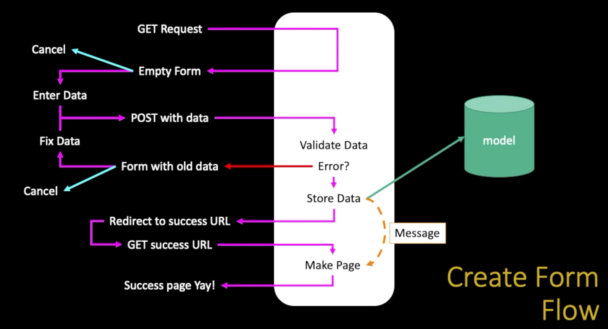

# Forms in HTTP and HTML

## Rules of the POST/GET choice

 - POST is used when data is being created or modified
 - GET is used when your are reading or searching things
 - GET should never be user to insert, modify or delete data
 - Web search spiders will follow GET URLs but generally not POST URLs
 - GET URLs should be "idempotent" - the same URL should give the "same thing" each time you access it
 - GET has an upper limit of the number of bytes of parameters and values (about 2K caracteres)

### Building HTML Forms
 - Pre HTML5 Input Types
   - text (id is to relate fields and labels; type="text" will parse the name="")
   - password (is a type="text" special case)
   - radio buttom (name="when" on all options is the rule)
   - check box (will parse the value="")
   - select / drop-down (will parse the value="")
   - textarea (need a buttom, type="submit" name="dopost" value="Submit"; dopost = Submit)

## Security

### CSRF - Cross-Site-Request-Forgery
- Atack:
 - A rogue can generates a page that includes from that posts data to a legitimate site where the user is logged in via a session cookie
 - The form is submitted to the legitimate site and the cookie is included
 - The legitimate site accepts the request because of the cookie value
 - Note: that the rogue site does not need to know the cookie value - it just knows that the coookie will be sent on a request to the legitimate site
- Defense:
  - The legitimate site chooses a large random number (the CSRF Token) and puts it in the session
  - When the legitimate site generates a POST form, it includes the CSRF Token as a hidden input field
  - When the form is submitted th CSRF Token is sent as well as the cookie
  - The site looks up the session and rejects the request if the incoming CSRF Token does not match the session's CSRF Token

#### Enabling CSRF defense in Django
 - Django has built in support to generate, use, and check CSRF Tokens
 - Activated by default in `settings.py`
```python
        MIDDLEWARE = [
            ...
            'django.middleware.csrf.CsrfViewMiddleware',
            ...
        ]
```
### CSRF in Forms

Django CSRF in Template
```python
<p>Guessing Game</p>

<p>{{ message }}</p>

<form method="post">
<p><label for="guess"> Input Guess </label>

<input type="text" name="guess" size="40" id="guess"/></p>
<input type="submit"/>
</form>
```

getpost/view.py
```python
class ClassyView(View):
    def get(self, request):
        return render(request, 'getpost/guess.html')
    
    def post(self, request):
        guess = request.POST.get('guess')
        msg = checkguess(guess)
        return render(request, 'getpost/guess.html', {'message' : msg})
```

## The POST Refresh Pattern

By default if we have a 200 error after making a POST request and the user hit refresh buttom the browser will redo de POST action and this is a pattern that reveals a real problem. So don't allow double posts.
 - typically POST request are adding or modifying data whilst GET request view data
 - it may be dangerous to do the same POST twice (say withdrowing funds from a bank account)
 - so the browser insists on asking the user (out of your control)
 - kind of an ugly UX / bad usability
 - as developers we work so this never can happen

## POST-REDIRECT-GET-Refresh

This solve the problem of POST Refresh Pattern
POST Redirect Rule

```python
class ClassyView(View):
    def get(self, request):
        msg = request.session.get('msg', False)
        if ( msg ) : del(request.session['msg'])
        return render(request, 'getpost/guess.html', {'message' : msg})
    
    def post(self, request):
        guess = request.POST.get('guess')
        msg = checkguess(guess)
        request.session['msg'] = msg
        return redirect(request.path)
```

# Forms in Django


https://docs.djangoproject.com/en/4.2/ref/templates/builtins/

## Data validation

```python
class Validate(View):
    #GET
    def get(self, request):
        old_data = {
            'title' : 'SakaiCar',
            'mileage' : 42,
            'purchase_date' : '2018-08-14'
        }
        form = BasicForm(initial=old_data)
        ctx = { 'form' : form }
        return render(request, 'form/form.html', ctx) #200
    
    # POST
    def post(self, request):
        form = BasicForm(request.POST)
        if not form.is_valid():
            ctx = { 'form' : form }
            return render(request, 'form/form.html', ctx) #200
        # if there are no errors, we would save the data
        return redirect('/form/success') #302 and than redirect to success

def success(request):
    return HttpResponse('Thank you') #200

```

TESTE


