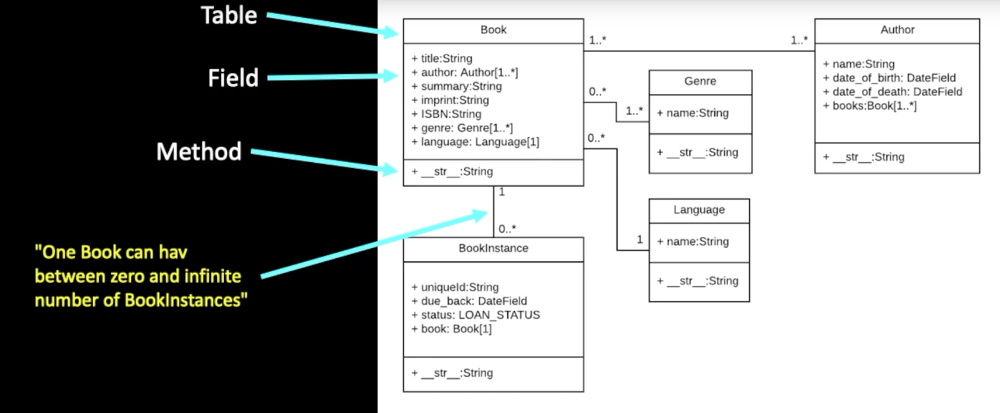
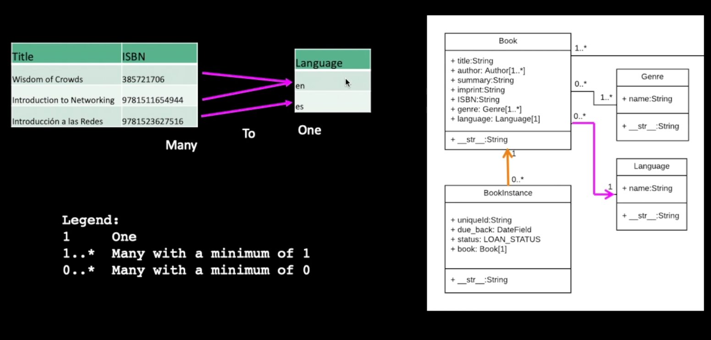
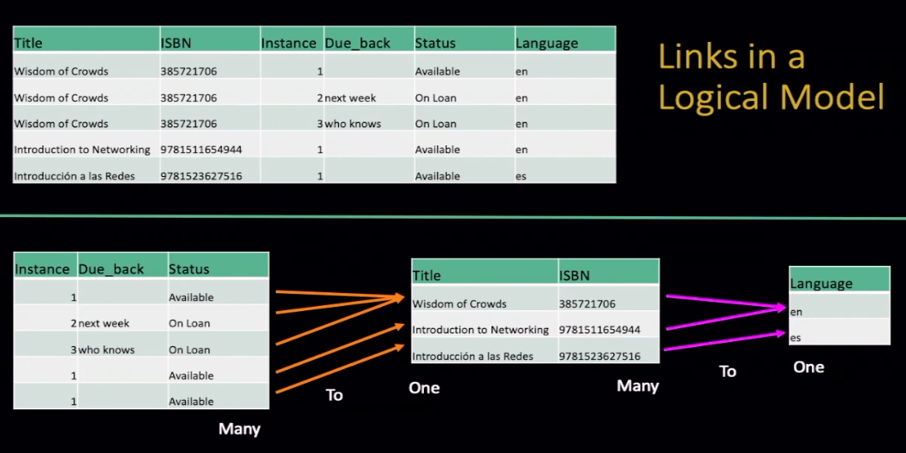
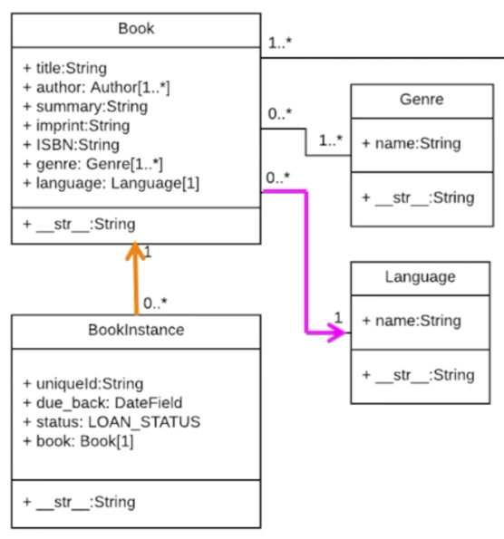

## Simple Django Data Models db

### SQL Sumary 
```bash
sqlite3 zip.sqlite3

.mode column

CREATE TABLE "Users" (
    "id" INTEGER PRIMARY KEY AUTOINCREMENT NOT NULL UNIQUE, 
    "name" TEXT,
    "email" TEXT
);

.tables

.schema Users

INSERT INTO Users (name, email) VALUES ('Carlos', 'carlos@email')
INSERT INTO Users (name, email) VALUES ('Kristen', 'kf@umich.edu');
INSERT INTO Users (name, email) VALUES ('Chuck', 'csev@umich.edu');
INSERT INTO Users (name, email) VALUES ('Colleen', 'cvl@umich.edu');
INSERT INTO Users (name, email) VALUES ('Ted', 'ted@umich.edu');
INSERT INTO Users (name, email) VALUES ('Sally', 'a1@umich.edu');

DELETE FROM Users WHERE email='carlos@email'
DELETE FROM Users WHERE email='ted@umich.edu';

UPDATE Users SET name="Carlos" WHERE email='carlos@email'

SELECT * FROM Users

SELECT * FROM Users WHERE email='carlos@email'

SELECT * FROM Users ORDER BY email;

SELECT * FROM Users ORDER BY name DESC;

DROP TABLE Users; 

.quit
```

## Object Relational Mapping - ORM

Allow to map tables to objects and columns
Use those objects to store and retrieve data from the db
improve portability across dbs dialects (SQLite, MySQL, Postgres, Oracle)
Django create a model in top of the dbs dialects

Python Model Library 
    models.py           < == >      dbs / dialects

#### Defining a Table:
 ```SQL
 CREATE TABLE Users(name VARCHAR(128), email VARCHAR(128));
 ```
 ```python
 //models.py

 from django.db import models

 class User(models.Model):
    name = models.CharField(max_length=128)
    email = models.CharField(max_length=128)
```
This is a migration explanation / implementation

In practice we do:
```python
python3 manage.py makemigrations

python3 manage.py migrate
```

## CRUD in the ORM

```python
u = User(name='Sally', email='sally@email')
u.save()

User.objects.values()
User.objects.filter(email='sally@email').values()

User.objects.filter(email='sally@email').delete()
User.objects.values()

User.objects.filter(email='sally@email').update(name='saly')
User.objects.values()

User.objects.values().order_by('email')
User.objects.values().order_by('-name')
```

### Model Field Types in ORM
- AutoField
- BigAutoField
- BigIntegerField
- BinaryField
- BooleanField
- CharField
- DateField
- DateTimeField
- DecimalField
- DurationField
- EmailField
- FileField
- FilePathField
- FloatField
- ImageField
- IntegerField
- GenericIPAddressField
- NullBooleanField
- PositiveIntegerField
- PositiveSmallIntegerField
- SlugField
- SmallIntegerField
- TextField
- TimeField
- URLField
- ForeignKey
- ManyToManyField
- OneToOneField

### Django for Everybody - Single Table Models

https://www.dj4e.com/lectures/DJ-02-Model-Single.txt

You can check out the Django code for this project at:

https://github.com/csev/dj4e-samples

Start the command line in a Linux/Bash shell and go into your project folder.
Activate a virtual environment if needed.
```bash
cd dj4e-samples
git pull                          # incase there are updates
pip install -r requirements4.txt  # to make sure that all the utilities are there

python manage.py check           # Make sure things are set up
python manage.py makemigrations  # Probably won't find any changes
rm db.sqlite3                     # In case you have done this before
python manage.py migrate         # Create the database and table(s)

#Start the django shell:

python manage.py shell

# (In the shell at the prompt) 

from users.models import User

u = User(name='Kristen', email='kf@umich.edu')
u.save()
u = User(name='Chuck', email='csev@umich.edu')
u.save()
u = User(name='Colleen', email='cvl@umich.edu')
u.save()
u = User(name='Ted', email='ted@umich.edu')
u.save()
u = User(name='Sally', email='a2@umich.edu')
u.save()

User.objects.values()
<QuerySet [{'id': 1, 'name': 'Kristen', 'email': 'kf@umich.edu'}, {'id': 2, 'name': 'Charles', 'email': 'csev@umich.edu'}, {'id': 3, 'name': 'Colleen', 'email': 'cvl@umich.edu'
}, {'id': 5, 'name': 'Sally', 'email': 'a2@umich.edu'}, {'id': 6, 'name': 'Kristen', 'email': 'kf@umich.edu'}, {'id': 7, 'name': 'Chuck', 'email': 'csev@umich.edu'}, {'id': 8, 
'name': 'Colleen', 'email': 'cvl@umich.edu'}, {'id': 9, 'name': 'Ted', 'email': 'ted@umich.edu'}, {'id': 10, 'name': 'Sally', 'email': 'a2@umich.edu'}]>

User.objects.filter(email='csev@umich.edu').values()
<QuerySet [{'id': 2, 'name': 'Charles', 'email': 'csev@umich.edu'}, {'id': 7, 'name': 'Chuck', 'email': 'csev@umich.edu'}]>

User.objects.filter(email='ted@umich.edu').delete()
User.objects.values()

User.objects.filter(email='csev@umich.edu').update(name='Charles')
User.objects.values()

User.objects.values().order_by('email')
User.objects.values().order_by('-name')

quit()
```

## Sumary of ORM

The Django Models feature implements an Object Relational Mapper
Benefits of it:
- can write only Python code, no need for explicit SQL codes;
- gain in db portability
- migrations both create and evolve the db schema
- a sweet administration interface
- automatic form generation and validation


# Migrations from Model to DB

- The `makemigrations` command reads all the models.py files in all the applications, end creates / evolves the migration files
- Guided by the applications listed in settings.py
- Migrations are portable across dbs
- The `migrate` command reads all the migrations folder in the application folders and creates / evolves the tables in the db.

The sumary is: `makemigrations` runs all models.py files and transforme it in a file that can actualy use explicit dbs languages. Than run `migrate` command to to run these new files created by the previous `makemigration` and finally combine models and / or data to the db.

# One-To-Many Data Models

model.py
admin.py

## Model Design
 - Model design is an art form of its own with particular skills and experience
 - Our goarl is to avoid the really bad mistakes and design clean and easily understood models
 - Model design starts with a sample data set and draws a picture



## Database Normalization (3NF)
 - there is tons of database theory/math - we simplify this to a few rules
 - Do not replicate data - reference data - point at data
 - add a special unique key column to each table which we will make references to. By convention many programmers and frameworks call this column id
 - use integers for to make links between tables - integers are fast and small




## Representing Links (Relationships) in a Database

First study, just slice the initial data set in as many tables as we need to do not repeat data


Applying concept of keys to link tables, primary-key and foreign-key


Basic modelling concept for the 3 tables we need, Languages, Books and Instance of Book

```python
from django.db import models

class Lang(models.Model):
    name = models.CharField(max_length=200)

class Book(models.Model):
    title = models.CharField(max_length=200) 
    isbn = models.CharField(max_length=13) 
    lang = models.ForeignKey('Lang', on_delete=models.SET_NULL, null=True) #allowing empty

class Instance(models.Model):
    book = models.ForeignKey('Book', on_delete=models.CASCADE)
    due_book = models.DataField(null=True, blank=True)
```

The data model diagram represents with the magenta arrow the `Book` data schema, and with the yellow arrow the `Instance` schema.



#### About on_delete
 - on_delete = set_null # => keep the row but set foreign key to null
 - on_delete = cascade # => delete the row

It's very important to correct manage conditions for the foreign keys to keep the table and the relationship between tables valid on deleting.

The conditions on_delete in the classes say:
- If a Language is deleted is ok for a Book to do not have any language, because Books are allowed to do not have a language by saying null=True `lang = models.ForeignKey('Lang', on_delete=models.SET_NULL, null=True)`
- If a Book is deleted we do not need an Instance for that particular Book, so we use cascade to delete all instances of the book that was deleted. `due_book = models.DataField(null=True, blank=True)`

## Using Models in the Django Shell

```shell
cd ~/dj4e-samples
python3 manage.py shell
```
```python
from bookone.models import Book, Lang, Instace
z = Lang(name='en')
z.save()
z.id

x = Book(title='PY4E', isbn='42', lang=z)
x.save()
x.id

a = Instance(due_back="2020-07-06", book=x)
a.save()
a.id

quit()
```

## Demo Bash Loading from CSV
```bash
pip3 install django-extensions
```
#### Make a scripts folder
```bash
mkdir scripts
touch scripts/__init__.py
```
We place empty __init__.py files in folders to indicate to Python that they contain files that hold modules and as such are suitable for importing into a Python application


