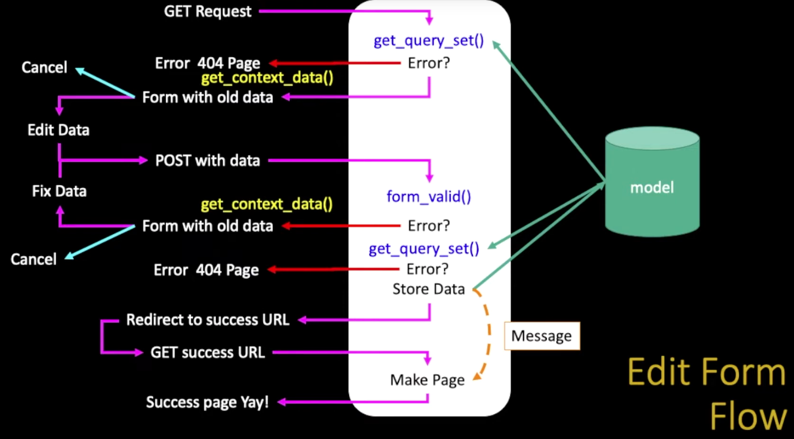

## Django Views and Templates

views are the CORE of the application

Django looks at the incomming request URL and uses urls.py to select a view

`HttpRequest`

```python
from django.http import HttpResponse
from django.http import HttpResponseRedirect

def func(request):
    response = 
    <html>
    </html>

    return HttpResponse(request)
```

## Secure Applications:

### XXS - Cross-Site Scripting

```python
from django.http import HttpResponse
from django.utils.html import escape # to xxs
from django.views import View

class RestMainView (View):
    def get(self, request, guess):
        response = 
        """<html>
            <body>
                <p> Your guess was""" +escape(guess)+ """</p>
            </body>
        </html>""""

        return HttpResponse (response)
```

Para controlar e mitigar ataques de Cross-Site Scripting (XSS) em um projeto Django, você pode seguir várias práticas recomendadas, incluindo o uso de mecanismos de segurança integrados no Django. A seguir estão algumas das configurações e práticas que ajudam a prevenir XSS em um projeto Django:

### 1. **Escapamento Automático de Templates**
Django, por padrão, escapa automaticamente o conteúdo inserido nos templates para prevenir XSS. Isso significa que, quando você renderiza variáveis em seus templates, Django automaticamente converte caracteres especiais em entidades HTML.

Exemplo:

```html
<!-- Dentro do template Django -->
<p>{{ user_input }}</p>
```

Neste exemplo, qualquer dado que o usuário inserir será automaticamente escapado. Se o usuário inserir `<script>alert('XSS')</script>`, ele será mostrado como texto e não será executado.

### 2. **Uso de Filtros de Template**
Django oferece filtros de template que ajudam a manipular e formatar dados antes de renderizá-los. Porém, evite desabilitar o escapamento automático usando o filtro `safe`, a menos que você tenha certeza de que os dados são seguros.

Exemplo a ser evitado:

```html
<p>{{ user_input|safe }}</p>  <!-- Não recomendado -->
```

### 3. **Proteção Contra XSS em Formulários**
Django inclui proteção contra XSS ao renderizar formulários com campos de texto. Os valores inseridos pelos usuários em campos de formulário são automaticamente escapados ao serem renderizados novamente na página.

### 4. **Uso de Content Security Policy (CSP)**
Content Security Policy (CSP) é uma camada de segurança que ajuda a prevenir ataques XSS controlando as fontes de recursos que o navegador pode carregar. Isso pode ser configurado em conjunto com o Django através de middleware ou cabeçalhos personalizados.

Exemplo de configuração CSP usando middleware em Django:

1. **Instalar o pacote `django-csp`:**
   ```bash
   pip install django-csp
   ```

2. **Adicionar `django-csp` ao `INSTALLED_APPS` no `settings.py`:**
   ```python
   INSTALLED_APPS = [
       # outros apps...
       'csp',
   ]
   ```

3. **Configurar as políticas CSP no `settings.py`:**
   ```python
   CSP_DEFAULT_SRC = ("'self'",)
   CSP_SCRIPT_SRC = ("'self'", 'https://trustedscripts.example.com')
   CSP_STYLE_SRC = ("'self'", 'https://trustedstyles.example.com')
   ```

### 5. **Sanitização de Entrada do Usuário**
Para dados que você não deseja escapar (por exemplo, quando você precisa renderizar HTML enviado pelo usuário), é importante sanitizar esses dados antes de armazená-los ou renderizá-los. Para isso, você pode utilizar bibliotecas como `bleach` para limpar e filtrar entradas.

Exemplo com `bleach`:

```python
import bleach

safe_input = bleach.clean(user_input)
```

### 6. **Headers de Segurança Adicionais**
Além do CSP, você pode usar middleware para adicionar outros cabeçalhos de segurança, como `X-XSS-Protection`, que ativa o modo de proteção contra XSS no navegador.

### 7. **Verificação Regular e Testes**
Por último, é essencial realizar revisões regulares de segurança e testar seus aplicativos com ferramentas de segurança automatizadas e manuais para garantir que não há brechas de XSS.

### Resumo
Django já oferece uma proteção significativa contra XSS através do escapamento automático de templates e outras funcionalidades padrão. No entanto, adicionar cabeçalhos de segurança como CSP, evitar o uso indiscriminado do filtro `safe`, e sanitizar entradas de usuários são práticas adicionais que ajudam a reforçar a segurança do seu aplicativo.

## Front End Template Process

URL => View => Template

rules for organize the templates.
Use a Technique called "namespace" so that each application can load its own templates.
`favs/templates/favs/details.html`
`pics/templates/pics/details.html`
For the namespace to work, we need to put templates in a path that includes the application name twice.

## DTL - Django Template Language

Substitution:
{{ zap }}
{{ zap|safe }}

Calling Code:



Logic:



Blocks:



## Inheritance
The art of not repeting yourself
 - when we make a new template - we can extend an existing template and then add our own little bit to make our new class
 - annother form of store and reuse
 - don't repeat yourself (DRY)

## URL Mapping / Reversing
A common need when working on a Django project is the possibility to obtain URLs in their final forms either for embedding in generated content or for hndling of the navigation flow on the server side (redirections, tc..)

It is strongly desirable to avoid hard-coding these URLs. Equally dangerous is devising ad-hoc mechanisms to generate URLs that are parallel to the design described by the URLconf, which can result in the production of URLs that become stale over time.

In other words, what's needed is a DRY mechanism. Among other advantages it would allow evolution of the URL design without having to go over all the project source code to search and replace outdated URLs.

The primary piece of information we have available to get URL is an identification (the name) of the view in charge of handling it. Other pieces of information that necessarily must participate in the lookup of the right URL are the types (positional, keyword) and values of the view arguments.


## Generic Views:
An exemple of appling inheritance

```python
class CatListView(View):
    def get(self, request):
        stuff = Cat.objects.all()
        cntx = { 'cat_list': stuff }
        return render(request, 'gview/cat_list.html', cntx)
```

CatListView is an obvious solution but is not a DRY one. Because it fits only for this case.
In the DogListView bellow we try to mahe method inside the class a little more flexible so we can apply to similar cases througth the `model` declaration.

```python
class DogListView(View):
    model = Dog
    def get(self, request):
        modelname = self.model._meta.verbose_name.title().lower()
        stuff = self.model.objects.all()
        cntx = { modelname+'_list' : stuff}
        return render(request, 'gview/'+modelname+'_list.html', cntx)
```
Now we can sofisticate more and transform it in a generic view as follows

project/gviews/views.py

```python
class ListView(View):
    def get(self, request):
        modelname = self.model._meta.verbose_name.title().lower()
        stuff = self.model.objects.all()
        cntx = { modelname+'_list' : stuff}
        return render(request, 'gview/'+modelname+'_list.html', cntx)
```

Here an exemple of how to reuse the generic class

```python
from django.views import generic

class HorseListView(generic.ListView):
    model = Horse
```

### Sumary:

- Generic Views allow us to produce lots of similar pages without cutting, pasting and editing boiler plates
- Quicker development
- Consistent User Experience
- Less lines of code means fewer mistakes

---

# Inside a Generic Edit View

`class django.views.generic.list.ListView`

A page representing a list of objects. While this view is executing, self.object_list will contain the list of objects (usually, but no necessarily a queryset) that this view is operating upon.

Method Flowchart
1. setup()
2. dispatch()
3. http_method_not_allowed()
4. get_template_names()
5. get_queryset()
6. get_context_object_name()
7. get_context_data()
8. get()
9. render_to_response()




## Owner List View


### Models:
Codes from samples/myarts/models.py

```python
from django.db import models
from django.core.validators import MinLengthValidator
from django.contrib.auth.models import User
from django.conf import settings


class Article(models.Model):
    title = models.CharField(
            max_length=200,
            validators=[MinLengthValidator(2, "Title must be greater than 2 characters")]
    )
    text = models.TextField()
    owner = models.ForeignKey(settings.AUTH_USER_MODEL, on_delete=models.CASCADE)
    created_at = models.DateTimeField(auto_now_add=True)
    updated_at = models.DateTimeField(auto_now=True)

    # Shows up in the admin list
    def __str__(self):
        return self.title
```

owner represents a Foreign Key to a table that belongs to Django.


### Views:
Codes from samples/myarts/views.py

```python
from myarts.models import Article
from myarts.owner import OwnerListView, OwnerDetailView, OwnerCreateView, OwnerUpdateView, OwnerDeleteView


class ArticleListView(OwnerListView):
    model = Article
    # By convention:
    # template_name = "myarts/article_list.html"

class ArticleDetailView(OwnerDetailView):
    model = Article

class ArticleCreateView(OwnerCreateView):
    model = Article
    # List the fields to copy from the Article model to the Article form
    fields = ['title', 'text']

class ArticleUpdateView(OwnerUpdateView):
    model = Article
    fields = ['title', 'text']
    # This would make more sense
    # fields_exclude = ['owner', 'created_at', 'updated_at']

class ArticleDeleteView(OwnerDeleteView):
    model = Article
```

This codes show how to do not repeat yourself.
Using the models to create all the new classes that we need (OwnerDeleteView, OwnerUpdateView, OwnerCreateView, OwnerDetailView, OwnerListView).

And now:
### Models:
Codes from samples/myarts/owner.py

```python
from django.views.generic import CreateView, UpdateView, DeleteView, ListView, DetailView
from django.contrib.auth.mixins import LoginRequiredMixin

class OwnerListView(ListView):
    """
    Sub-class the ListView to pass the request to the form.
    """

class OwnerDetailView(DetailView):
    """
    Sub-class the DetailView to pass the request to the form.
    """

class OwnerCreateView(LoginRequiredMixin, CreateView):
    """
    Sub-class of the CreateView to automatically pass the Request to the Form
    and add the owner to the saved object.
    """

    # Saves the form instance, sets the current object for the view, and redirects to get_success_url().
    def form_valid(self, form):
        print('form_valid called')
        object = form.save(commit=False)
        object.owner = self.request.user
        object.save()
        return super(OwnerCreateView, self).form_valid(form)

class OwnerUpdateView(LoginRequiredMixin, UpdateView):
    """
    Sub-class the UpdateView to pass the request to the form and limit the
    queryset to the requesting user.
    """

    def get_queryset(self):
        print('update get_queryset called')
        """ Limit a User to only modifying their own data. """
        qs = super(OwnerUpdateView, self).get_queryset()
        return qs.filter(owner=self.request.user)

class OwnerDeleteView(LoginRequiredMixin, DeleteView):
    """
    Sub-class the DeleteView to restrict a User from deleting other
    user's data.
    """

    def get_queryset(self):
        print('delete get_queryset called')
        qs = super(OwnerDeleteView, self).get_queryset()
        return qs.filter(owner=self.request.user)
```

### References

 https://docs.djangoproject.com/en/4.2/ref/class-based-views/mixins-editing/#django.views.generic.edit.ModelFormMixin.form_valid

 https://stackoverflow.com/questions/862522/django-populate-user-id-when-saving-a-model

 https://stackoverflow.com/a/15540149

 https://stackoverflow.com/questions/5531258/example-of-django-class-based-deleteview


