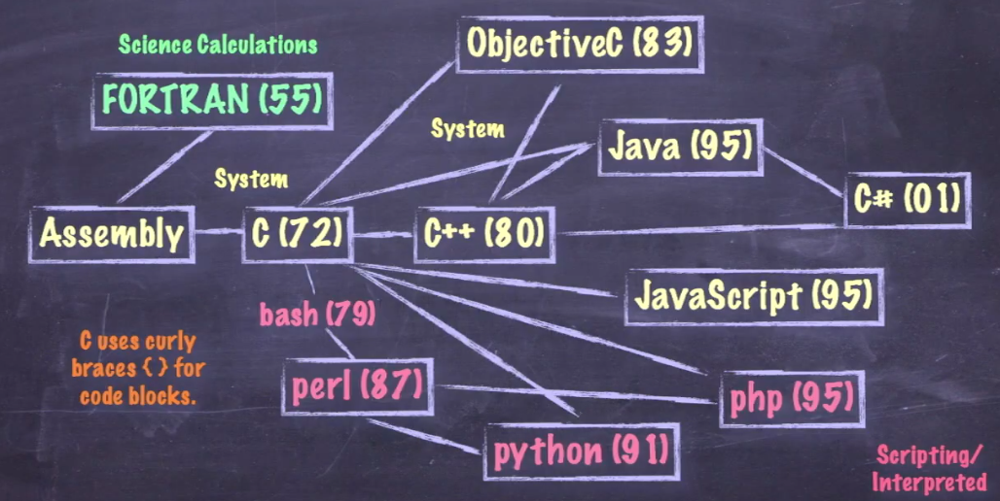
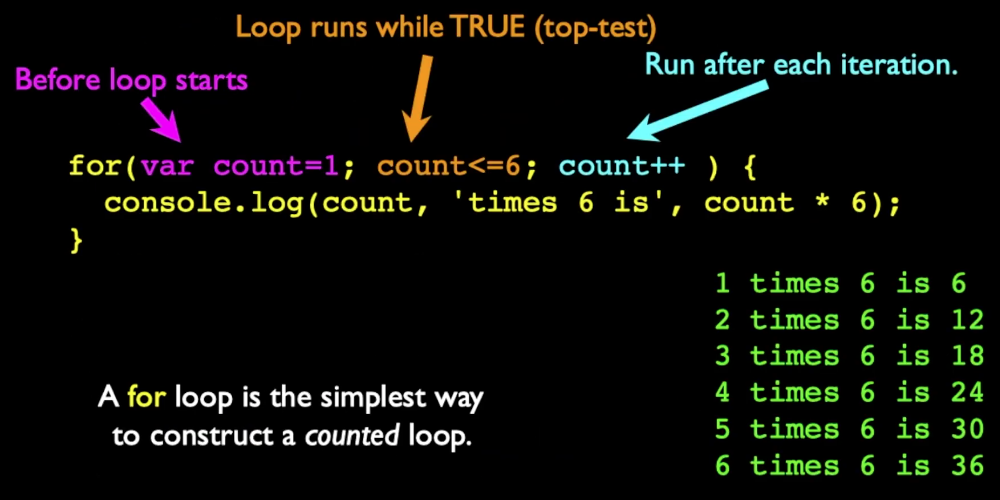

# JavaScript



## Base of writing JavaScript
 - Augment HTML using the Document Object Model (DOM) - Vanila JavaScript (basic JS)
 - Augment HTML using a library like JQuery
 - Building an MVC application in the browser using Vue/React
 - Building a server side application using Node/Express

### Variable Names
- valid characters: a-z, A-Z, 0-9, _ and $
- must not start with a number
- names are case sensitive
- starting with a dollar sign in considered "tacky" (don't use it)

### String Constants
- Double or single quotes:
    - Single quotes are typically in JavaScript
    - Double quotes we let HTML use. It's best practice
- Character Escaping - done using the backslash character

```HTML
<script type="text/javascript">
    alert('One line \nTwo line');
</script>
```

### Numeric Constants
- constant syntax is like most other languages
- weirdness: there is only one Number Type (no int or float) - Number

### Comparison Operators

'>> j = 10
this is a statement. 
j has been assigned to the value of 10.

'>> j == 10
this is a verification.
Is j iquals to 10?

'>> j != 10
this is a verification.
Is j not 10?

'>> j === 10
this is a verification.
Has j the value of 10 and also the same kind as 10.

### Logical Operators

'>> k > 1 && j < 5 (AND)
both sides must be true to evaluate the expression to true.
if one of the sides or both of then are false the expression evaluates to false.

'>> k > 1 || j < 5 (OR)
just one of these sides must be true to evaluate the expression to true.
if both are true the expression also evaluates to true.
evaluates to false only if both sides are false.

'>> ! (k > 10) (NOT)
evaluates to true only if the condition k > 10 is false.

### Variable Conversion

If a string cannot be converted to a number, you end up with "Not a Number" or "NaN". It is a value, but it is sticky - all operations with NaN as a operand end up with NaN.

'>> x = "fred" + 1
NaN
'>> isNaN(x)
NaN
'>> x = x + 1
NaN
'>> y = 42/0
Infinity
'>> isNaN(y)
false
'>> isInfinity(y)
false

## Functions and Arrays

Use the typical syntax and are indicated using the function keyword
The return keyword functions as expected

```HTML
<script type="text/javascript">
    function product(a, b) {
        value = a + b;
        return value;
    };
    console.log("Prod = "+product(4, 5));
</script>
```

### Scope - Global (defalt)
- variables defined outside a function that are refered inside of a function have global scope
- this is a little different than what are expected
    - Making a Variable Local:
      - In a function, the parameters (formal arguments) are local and any variable we mark with the var keywords are local too.
  
```HTML
<script type="text/javascript">
    g1 = 123;
    function check() {
        var g1 = 456;
    }
    check();
    console.log("GL = "+g1);
</script>
```  
---
#### In Python we have Dictionaries & Lists
#### In Javascript we have Objects & Arrays
---

## Control Structures

### Conditionl - if

 - Logical operators:
     - ==   is it the same as
     - !=   not equal
     - <    less than
     - '>    greater than
     - <=   less or equal than
     - '>=   greater or equal than
     - &&   AND
     - ||   OR
     - !    NOT
     - ===  same as and same type as
     - !==  is it not the same as
 - Curly braces

```HTML
<script type="text/javascript">
    var ans = 42;
    if (ans == 42) {
        console.log("Hello world!");
    } else {
        console.log("Wrong answer");
    }
</script>
```
### Multi-way Ifs

```HTML
<script type="text/javascript">

    var x = 7;

    if (x < 2) {
        console.log("Small");
    } elseif ( x > 10) {
        console.log("Medium");
    } else {
        console.log("Large");
    }
    console.log("All done");

</script>
```

A While loop is a "zerp-trip" loop with the test at the top before the first iteration starts. 
We hand a construct the iteration variable to implement a counted loop.

```Javascript
var fuel = 10;

while (fuel > 2) {
    console.log("Not in Reserve Alarm Mode")
    fuel = fuel -1;
}
console.log("Reserve Mode - Refill the Tank!");
```

### for loop



### Breaking Out of a loop
The break statement ends the current loop and jumps to the statement immediately following the loop.

---

# Object Oriented Programming in JavaScript
is exactly the same as in other languages!

## Definitions:
- Class: a temple - Dog
- Method or Message - a defined capability of a class - bark()
- Attribute - a definid data item in a class - color
- Object or Instance - a particular instance of a class - Lassie

## Terminology:

### Instance:
One can have an instance of a Class or a particular object. The instance is the actual object created at runtime, In programmer jargon, the Lassie object is an instance of the Dog class.The set of values of the attributes of a particular object is called its state. The object consists of state and the behavior that's defined in the object's class.

### Method:
An object's abilities. In language, methods are verbs. Lassie, being a Dog, has the ability to bark. So bark() is one of Lassie's methods. She may have other methods as well, for exemple sit() or eat() or walk(). Within the program, using a method usually affects only one particular object; all Dogs can bark, but you need only one particular dog to do the barking.

### Objects in Javascript
- The Object Oriented (OO) pattern in JS is a little different
- The function is indeed a store and reuse pattern
- The function keyword returns a value which is the function itself - it makes a function!

### First-Class Functions
In computer science, a programming language is said to have first-class functions if it treats functions as first-class citzens. Specifically, this means the language supports passing functions as arguments to other functions ,returning them as the values from other functions, and assigning them to variables or storing them in data structures.


